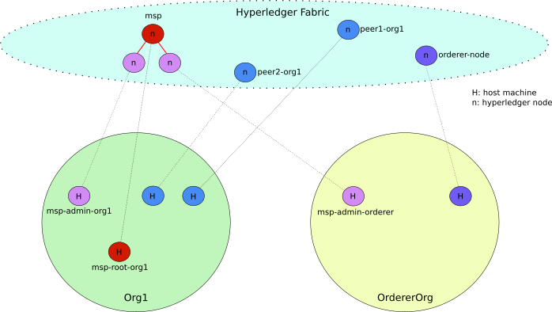

= Deploy and use Hyperledger Fabric on multiple nodes - a simple path.


== Introdution

In this document we show how to proceed to deploy a simple Blockchain
infrastructure composed of multiple nodes.
The goal of this study is: _i_) better understand the deployment of Hyperledger
Fabric in realistic environments (i.e., composed of multiple machines).
_ii_) make a step forward from the environment targeted by the official Hyperledger
documentation which is based only on a single node with multiple containers.
We argue that this approch hides many important details of process of deploying
and using the Hyperledger framework.
We propose here a procedure and a series of step-by-step scripts that make it easy
to deploy and use Hyperledger Fabric

== Target environment

In this document we target a simple environment composed of 2 different
organizations. One organization in charge of orderer nodes and another organization
hosting peers and the MSP root service (e.i., the CA-Root).
The former is composed of 4 (four) hosts (ca-server root, ca-administrator,
peer1 and peer2) and the latter composed of 2 hosts (ca-administrator and orderer node).
The figure below depicts this multi-node environment.
The host msp-root-org1 is the ca-server root. msp-admin-org1 and msp-admin-orderer
are the ca-administrator for each organization, peer1-org1 and peer2-org1 are the
two peers present in the system and the orderer-node is where transactions are
validated. Note that, we use in this example a single node as ordering service in order to
make it easier. In a subsequent document we will improve it with a multi-node
ordering service

:TODO: put a figure here to represent the environment



== Download scripts

We have created a series of scripts to make the whole process of deploying and using
the Hyperledger Blockchain easier. Our goal is not only facilitate the process of
deploying Hyperledger but also to make it easier to understand every step of the
full process.

To download the scripts follow the *_link_* [[link]].

:TODO: make a link or something to download the scripts.

Download the files within a directory of your choice,
lets call this directory your 'base_local_dir'.
Your 'base_local_dir' will have the following structure.

```
.
├── shared
│   ├── chaincode_examples
│   │   └── example1
│   │       ├── scripts
│   │       └── src
│   ├── config_files
│   ├── install
│   └── setup_scripts
└── src_vagrant
│
└── Vagrantfile
```

The `shared` directory is the directory shared between your local machine and
the hosts (virtual machines) to be used as hyperledger nodes.
We discuss this directory in details later <<shared_vagrant_dir,here>>.
The `src_vagrant` directory has the sources for our vagrant deployment.
Currently, it has two different versions of the `Vagrantfile`, one for Openstack
and another for Virtualbox deployments. We must copy the content of one of this
files into the `Vagrantfile` at the root of you 'base_local_dir', according to the
deployment of your choice. By default we use Openstack deployment.


== How to use the scripts to deploy Hyperledger

If you have successfully downloaded the scripts as described above now you are
able to start using them. Lets start by briefly describing how we use vagrant
to deploy Hyperledger hosts.

[[conf-overview]]
=== Host configuration

We use https://www.vagrantup.com/[vagrant] to deploy the virtual machines at same
time with a specific configuration. If you do not have vagrant installed in your
local machine yet, please take the time to do that now.
The vagrant file (`Vagrantfile`) is where these configurations are stored.
We use the openstack plugin (https://github.com/ggiamarchi/vagrant-openstack-provider)
to deploy these machines in our Openstack cluster.

In the `Vagrantfile`, each host is defined as an entry in a data structure
called *_cluster_*. Each entry (host) in *_cluster_* has the following structure.

[source, ruby]
----
{
    :name => "msp-root-org1",
    :username => "ubuntu",
    :type => "ca-server",
    :box => "ubuntu1604_img",
    :flavor => "j1.medium",
    :netid => "d085327f-2cea-4e14-8784-764ee72b92f4",
    :netadd => "192.168.1.10",
    :privkeyfile => "~/.ssh/openstack_cloudlab_bcom.key"
}
----
With `name` informing the hostname to be deployed, `username` the default user to
be created in that host, `type` the type of node according to the Hyperledger
architecture (e.g., peer, orderer, msp-admin, msp-root, etc.)
If you want to take a look in the full `Vagrantfile` and the detailed configuration
of all the hosts, check the  <<appendix:vagrantfile, Appendix>>.

=== Deploy all nodes (VMs)

Use the e *vagrant up* command in order to deploy our machines.
Note that, this operation takes few minutes, depending on the number of hosts to
deploy. Thus, execute the command as show below and go for a coffee.

[source, bash]
----
$ vagrant up
----

When the deployment finishes, you can check the status of each deployed virtual machine.

[source, bash]
----
$ vagrant status
Current machine states:
name                      state    provider
--------------------------------------------
msp-root-org1             active (openstack)
msp-admin-org1            active (openstack)
msp-admin-orderer         active (openstack)
orderer-node              active (openstack)
peer1-org1                active (openstack)
peer2-org1                active (openstack)
----

In order to check the deployment connect to one of the hosts (e.g., msp-root-org1)
from your local machine using any terminal.

[source, bash]
----
$ vagrant ssh msp-root-org1
----

[[shared_vagrant_dir]]
Vagrant creates the hosts defined in the `Vagrantfile` and sets a ssh configuration
`~/.ssh/config` at each node with entries to all the other nodes
as well as `/etc/hosts` and `/etc/resolv.conf` files.
These files are dynamically created during the vagrant deployment thanks to some
ruby code that we have previously added to it.
Vagrant also creates a directory called `~/hyperledger_ws`
(i.e., hyperledger workspace) at the home directory of each host, which we refer
to as HYPERLEDGER_HOME directory.
The directory has the following structure and content.

[source, bash]
----
$ cd hyperledger_ws/

~/hyperledger_ws$ tree -dL  1
.
├── install
├── setup_scripts
├── config_files
└── chaincode_example
----

- *install*: directory that contains the scripts used to install Hyperledger Fabric
software in the hosts and create the base configuration for each.

- *setup_scripts*: directory that contains the scripts used to set up Hyperledger
environment and its configuration.

- *config_files*: directory that contains template files used to configure Hyperledger
environment.

- *chaincode_examples*: directory that contains the chaincode example used to validate
the installation and configuration.

After checking these directories, logout (exit) back to your local host.

=== Installing Hyperledger Fabric software

In order to ease the installation process we provide two different terminal
layouts that will be used during the installation and configuration processes.
The first layout configuration file (`terminator_config`) must be used with the
terminal emulator called _terminator_ that must be installed in your local host,
and the second (windows.tmux.hlf) will be used with _byobu_ from a ssh connection
between your local host and one of the virtual machines created by vagrant.
In order to install the Fabric software on the hosts we will use the first
terminal layout based on terminator.

====== Using Terminator layouts

We use the `terminator` to perform some repetitive tasks that are required to
install Hyperledger fabric on all hosts.
The reason is that `terminator` has a very good broadcast feature.
Therefore, to install all the required software at once on hosts we provide
a layout configuration file called `./install/terminator_config` which allows to
run scripts in one terminal screen connected to one machine and broadcast this
commands to the others. Note that, there are other more advanced ways of doing that,
for instance by using https://www.ansible.com[ansible] tool. We have chosen at this
point not to use ansible in order to avoid a stack of configuration tools that would
hide important details of the configuration. We recall that on of our goals is to
make it clear to the reader the configuration and utilization of Hyperledger
Fabric.

First, install `terminator` into your local machine, if you do not have it.
If you already have `terminator` installed please skip this step.
[source, bash]
----
$ sudo apt-get install terminator
----

Then, copy our configuration file to `~/.config/terminator/config` in your home
directory.

[source, bash]
----
$ cp .shared/install/terminator_config  ~/.config/terminator/config
----

Finally invoke the terminator layout to install Hyperledger Fabric as follows:

[source, bash]
----
$ terminator -l simple_hlf
----

As as result terminator  will open a terminal with a specific layout using multiple
tabs.
If everything goes well each tab will be connected through ssh to one of the
Hyperledger hosts deployed by vagrant, as shown below.

image::img/terminator.png[]

NOTE: Please, be sure that any command (e.g., ls) executed in the first tab (msp-root-org1)
is broadcast to all the other hosts.
If not, check if the option `Broadcast default` is set to `Group` in `terminator`
preferences. If everything goes well with the broadcast, go to the next section.


==== Installing Fabric

In this section we show how to get all the required software installed at all the
hosts at once by using the `terminator` layout shown in the previous section.
Our procedure presents the all the steps required to install Hyperledger Fabric
using our installation scripts.

Go to the first tab (i.e., host msp-root-org1) in your `terminator` environment
and take a look on the installation scripts.

[source, bash]
----
$ cd hyperledger_ws/install
$ ls
    01_install_docker.sh
    02_install_prereqs.sh
    03_install_bootstrap.sh
    04_install_ca_server.sh
    05_setup_go_libs_for_peers_chaincodes.sh
    broadcast_cmd.sh
    check_prereqs.sh
    fabric.env.sh
    setup_byobu.sh
    terminator_config
    windows.tmux.hlf
----

Note that, the scripts are named according to the order of execution (from 01_*.sh
to 05_*.sh) and their function in the installation process (e.g., install_docker, install_ca_sever).

Please, run the scripts one-by-one from the 'install' directory at each node as
follows.


===== Install docker

In order to install docker run the script as follows.

[[docker_install]]
[source, bash]
----
$ ./01_install_docker.sh
----

You can also check a full log of docker installation in section
<<appendix:installdocker, Appendix B: Installation logs>>.

When finished, logout from all hosts and reconnect again with the same `terminator`
layout again. Then check the installation as shown below.


[source, bash]
----
$ docker ps
CONTAINER ID    IMAGE   COMMAND    CREATED   STATUS    PORTS   NAMES

$ docker --version
Docker version 19.03.3, build a872fc2

$ docker info
----

===== Install fabric requirements

In order to install Hyperledger Fabric requirements run the script as follows.

[[req_install]]
[source, bash]
----
$ ./02_install_prereqs.sh
----

You can check a full log of fabric requirements installation in section
<<appendix:req_install, Appendix B: Installation logs>>.

When finished, logout from all hosts and reconnect again with the same `terminator`
layout again. Note that, when logging back you will be (from now on) automatically
redirected to `~/hyperledger_ws` directory (i.e., $HYPERLEDGER_HOME).

You can now check if all the fabric basic requirements were install by using the
script below.

[[req_check]]
[source, bash]
----
$~/hyperledger_ws/install$ ./check_prereqs.sh

----


NOTE: Be sure that all requirements are correctly installed on each host.

You can check the output log of the check in section
<<appendix:req_check, Appendix B: Installation logs>>.

===== Install bootstrap binaries and images

In order to install the binaries and required images please run the script as follows.

[[bootstrap_install]]
[source, bash]
----
$ ./03_install_bootstrap.sh
----

You can check the full log of binaries and images installation in section
<<appendix:fabric-bootstrap, Appendix B: Installation logs>>.


===== install Go libraries for peer and chaincode

Run the script as shown below in order to install the GO libraries for peers and
chaincode.

[[go_lib_install]]
[source, bash]
----
$ ./04_setup_go_libs_for_peers_chaincodes.sh
----
Check the full log of Go libraries installation in section
<<appendix:fabric-go-lib, Appendix B: Installation logs>>.

When finished, logout from all hosts.


===== Install CA-Root host

Finally the last step of the installation is to install the certification authority
root server at the host which is in charge of this service.
In our case, the host `msp-root-org1`.
Thus, connect through ssh on this host using the command `*vagrant ssh msp-root-org1*` from
your local machine and run the following script.
After connected, run the script shown below from the `install` directory.

[[ca_root_install]]
[source, bash]
----
$ ./05_install_ca_server.sh
----

Check the full log of the CA-server installation in section
<<appendix:fabric-ca-root, Appendix B: Installation logs>>.


NOTE: If all the previous steps went well, you are ready to start configuring your
Hyperledger Fabric as we will discuss in the next section.


=== Setting up Hyperledger Blockchain configuration


Before continuing make sure that the terminator broadcast is set to off.
From now one, you will run the commands at each individual node.

==== Configure the MSP and its Certification authority entities

The first step is to set up the certification authority infrastructure.

Nodes of type *msp* are the hosts in charge of the cerfification authority (CA).
Among them, there is a host named `msp-root-org1` which is the CA administrator.
The other nodes are named according to the organization they belong to.
For instance, the host `msp-admin-org1` is the host which runs the MSP service for
organization *Org1*.

===== Setting CA-root and root-admin


Go to the CA administration host msp-root-org1 and perform the following.

.1. Start the CA-Root server.

run `$HYPERLEDGER_HOME/setup_scripts/01_start_ca_server.sh` to start the CA server.


[source, bash]
----
./01_start_ca_server.sh

--------------------------------------------------------------------------------
Starting CA-Server
--------------------------------------------------------------------------------
checking /home/ubuntu/hyperledger_ws/ca-server/fabric-ca-server-config.yaml
Server YAML not found in /home/ubuntu/hyperledger_ws/ca-server/
Copying /home/ubuntu/hyperledger_ws/config_files/fabric-ca-server-config.yaml to /home/ubuntu/hyperledger_ws/ca-server
Starting server with: /home/ubuntu/hyperledger_ws/ca-server/fabric-ca-server-config.yaml
Server Started ... Logs available at /home/ubuntu/hyperledger_ws/ca-server/ca-server.log
---------------------------- /home/ubuntu/hyperledger_ws/ca-server/ca-server.log -----------------------------------
2019/10/17 14:05:21 [INFO] Configuration file location: /home/ubuntu/hyperledger_ws/ca-server/fabric-ca-server-config.yaml
2019/10/17 14:05:21 [INFO] Starting server in home directory: /home/ubuntu/hyperledger_ws/ca-server
2019/10/17 14:05:21 [WARNING] Unknown provider type: ; metrics disabled
2019/10/17 14:05:21 [INFO] Server Version: 1.4.4
2019/10/17 14:05:21 [INFO] Server Levels: &{Identity:2 Affiliation:1 Certificate:1 Credential:1 RAInfo:1 Nonce:1}
2019/10/17 14:05:21 [WARNING] &{69 The specified CA certificate file /home/ubuntu/hyperledger_ws/ca-server/ca-cert.pem does not exist}
2019/10/17 14:05:21 [INFO] generating key: &{A:ecdsa S:256}
2019/10/17 14:05:21 [INFO] encoded CSR
2019/10/17 14:05:21 [INFO] signed certificate with serial number 253536844534618074797938040418171009842463908182
2019/10/17 14:05:21 [INFO] The CA key and certificate were generated for CA ca-root
2019/10/17 14:05:21 [INFO] The key was stored by BCCSP provider 'SW'
2019/10/17 14:05:21 [INFO] The certificate is at: /home/ubuntu/hyperledger_ws/ca-server/ca-cert.pem
---------------------------- /home/ubuntu/hyperledger_ws/ca-server/ca-server.log -----------------------------------
----

You can check all the crypto material created as shown above.

[source, bash]
----
$ tree ../ca-server/

../ca-server/
├── ca-cert.pem
├── ca-server.log
├── fabric-ca-server-config.yaml
├── fabric-ca-server.db
├── IssuerPublicKey
├── IssuerRevocationPublicKey
└── msp
    └── keystore
        ├── f0c0cf0e53ddea32fa2cf6db05791ce5a88341f9c6c4b2952b65b325a5f4fd51_sk
        ├── IssuerRevocationPrivateKey
        └── IssuerSecretKey

2 directories, 9 files

----


.2. Enroll the bootstrap identity of our CA server

[source, bash]
----
$ ./02_enroll_bootstrap_identity.sh

--------------------------------------------------------------------------------
Enrolling bootstrap Identity
--------------------------------------------------------------------------------
current FABRIC_CA_CLIENT_HOME=
now FABRIC_CA_CLIENT_HOME=/home/ubuntu/hyperledger_ws/ca-client/caserver/admin
File [fabric-ca-client-config.yaml] not found in [/home/ubuntu/hyperledger_ws/ca-client/caserver/admin/]
mkdir -p /home/ubuntu/hyperledger_ws/ca-client/caserver/admin
Copying /home/ubuntu/hyperledger_ws/config_files/fabric-ca-client-config.yaml to /home/ubuntu/hyperledger_ws/ca-client/caserver/admin
Enrolling bootstrap Identity (ca-client) with: /home/ubuntu/hyperledger_ws/ca-client/caserver/admin/fabric-ca-client-config.yaml
fabric-ca-client enroll -u http://admin:pw@192.168.1.10:7054
2019/10/17 14:07:39 [INFO] generating key: &{A:ecdsa S:256}
2019/10/17 14:07:39 [INFO] encoded CSR
2019/10/17 14:07:40 [INFO] Stored client certificate at /home/ubuntu/hyperledger_ws/ca-client/caserver/admin/msp/signcerts/cert.pem
2019/10/17 14:07:40 [INFO] Stored root CA certificate at /home/ubuntu/hyperledger_ws/ca-client/caserver/admin/msp/cacerts/192-168-1-10-7054.pem
2019/10/17 14:07:40 [INFO] Stored Issuer public key at /home/ubuntu/hyperledger_ws/ca-client/caserver/admin/msp/IssuerPublicKey
2019/10/17 14:07:40 [INFO] Stored Issuer revocation public key at /home/ubuntu/hyperledger_ws/ca-client/caserver/admin/msp/IssuerRevocationPublicKey
-------------- showing identities ----------------------
Name: admin, Type: client, Affiliation: , Max Enrollments: -1, Attributes: [{Name:hf.GenCRL Value:1 ECert:false} {Name:hf.Registrar.Attributes Value:* ECert:false} {Name:hf.AffiliationMgr Value:1 ECert:false} {Name:hf.Registrar.Roles Value:* ECert:false} {Name:hf.Registrar.DelegateRoles Value:* ECert:false} {Name:hf.Revoker Value:1 ECert:false} {Name:hf.IntermediateCA Value:1 ECert:false}]
--------------------------------------------------------
ubuntu@msp-root-org1:~/hyperledger_ws/setup_scripts$

----


.3. Register the organization's admin into our CA server

In the following example we are registering 2 admins, one for each organization.

.3.1 Register admin for msp-admin-org1

[source, bash]
----
$ ./03_register_admin.sh client org1-admin  pw  org1 org1

current FABRIC_CA_CLIENT_HOME=
now FABRIC_CA_CLIENT_HOME=/home/ubuntu/hyperledger_ws/ca-client/caserver/admin
Registering: org1-admin
2019/10/17 14:08:54 [INFO] Configuration file location: /home/ubuntu/hyperledger_ws/ca-client/caserver/admin/fabric-ca-client-config.yaml
Password: pw
NOTE:  inform the user <org1-admin> and password <pw> to the admin of the organization <org1>
(this information is also required to enroll organization\'s clients)

----

.3.2 Register admin for msp-admin-orderer


[source, bash]
----
$ ./03_register_admin.sh client orderer-admin pw orderer orderer

current FABRIC_CA_CLIENT_HOME=
now FABRIC_CA_CLIENT_HOME=/home/ubuntu/hyperledger_ws/ca-client/caserver/admin
registering an orderer , setting attributes
Registering: orderer-admin
2019/10/17 14:09:01 [INFO] Configuration file location: /home/ubuntu/hyperledger_ws/ca-client/caserver/admin/fabric-ca-client-config.yaml
Password: pw
NOTE:  inform the user <orderer-admin> and password <pw> to the admin of the organization <orderer>
(this information is also required to enroll organization\'s clients)

----

.4. Check the CA-Root identity list

Check the list of entities registered into the CA-Root server

[source, bash]
----
$ ./list_ca-server_identity-list.sh

------------Fabric ENV -----------------
FABRIC_CA_SERVER_CONFIG_FILE=fabric-ca-server-config.yaml
FABRIC_VERSION=1.4.0
FABRIC_LOGGING_SPEC=INFO
FABRIC_CA_CLIENT_CONFIG_FILE=fabric-ca-client-config.yaml
FABRIC_USER=ubuntu
FABRIC_CA_SERVER_HOME=/home/ubuntu/hyperledger_ws/ca-server
BASE_FABRIC_CA_CLIENT_HOME=/home/ubuntu/hyperledger_ws/ca-client
FABRIC_CFG_PATH=/home/ubuntu/hyperledger_ws/fabric
FABRIC_CA_SERVER_LOG=/home/ubuntu/hyperledger_ws/ca-server/ca-server.log

------------Setting HOME ---------------
current FABRIC_CA_CLIENT_HOME=
now FABRIC_CA_CLIENT_HOME=/home/ubuntu/hyperledger_ws/ca-client/caserver/admin

------------Listing Identities----------
Name: admin, Type: client, Affiliation: , Max Enrollments: -1, Attributes: [{Name:hf.GenCRL Value:1 ECert:false} {Name:hf.Registrar.Attributes Value:* ECert:false} {Name:hf.AffiliationMgr Value:1 ECert:false} {Name:hf.Registrar.Roles Value:* ECert:false} {Name:hf.Registrar.DelegateRoles Value:* ECert:false} {Name:hf.Revoker Value:1 ECert:false} {Name:hf.IntermediateCA Value:1 ECert:false}]
Name: org1-admin, Type: client, Affiliation: org1, Max Enrollments: -1, Attributes: [{Name:hf.AffiliationMgr Value:true ECert:false} {Name:hf.Revoker Value:true ECert:false} {Name:hf.Registrar.Roles Value:peer,user,client ECert:false} {Name:hf.EnrollmentID Value:org1-admin ECert:true} {Name:hf.Type Value:client ECert:true} {Name:hf.Affiliation Value:org1 ECert:true}]
Name: orderer-admin, Type: client, Affiliation: orderer, Max Enrollments: -1, Attributes: [{Name:hf.Registrar.Roles Value:orderer ECert:false} {Name:hf.EnrollmentID Value:orderer-admin ECert:true} {Name:hf.Type Value:client ECert:true} {Name:hf.Affiliation Value:orderer ECert:true}]
----------------------------------------

----


.5. Keep monitoring the CA-server

[source, bash]

----
$ tail -f   /home/ubuntu/hyperledger_ws/ca-server/ca-server.log
----


===== Setting the CA-admintrator at each Organization

Each organization has its own CA-adminstrator. The CA-adminstrator at each organization
needs to enroll the client registered by the CA-Root administrator in the previous step.

We deploy one host for each organization (i.e., msp-admin-org1 and msp-admin-orderer).


.1. Enroll the local admin for the org1 organization and setup the msp.

Go to the `msp-admin-org1` host and run the following command from the
`setup_scripts` directory.

:NOTE: You might be required to confirm a ssh connection among nodes, because during the setup of a MSP some crypto material is copied from the CA-Root, such as the Root certificate.

[source, bash]
----
$ ./04_enroll_admin_and_setup_msp.sh org1  msp-root-org1 192.168.1.10

current FABRIC_CA_CLIENT_HOME=
now FABRIC_CA_CLIENT_HOME=/home/ubuntu/hyperledger_ws/ca-client/org1/admin
/home/ubuntu/hyperledger_ws/ca-client/org1/admin/fabric-ca-client-config.yaml not found in /home/ubuntu/hyperledger_ws/ca-client/org1/admin/
creating : mkdir -p /home/ubuntu/hyperledger_ws/ca-client/org1/admin
Copy /home/ubuntu/hyperledger_ws/config_files/fabric-ca-client-config-org1-admin.yaml  to /home/ubuntu/hyperledger_ws/ca-client/org1/admin/fabric-ca-client-config.yaml
checking with: ls /home/ubuntu/hyperledger_ws/ca-client/org1/admin/fabric-ca-client-config.yaml
/home/ubuntu/hyperledger_ws/ca-client/org1/admin/fabric-ca-client-config.yaml
File /home/ubuntu/hyperledger_ws/ca-client/org1/admin/fabric-ca-client-config.yaml found.
###################################
Enrolling: org1-admin:
###################################
fabric-ca-client enroll -u http://org1-admin:pw@192.168.1.10:7054
2019/10/17 14:40:06 [INFO] generating key: &{A:ecdsa S:256}
2019/10/17 14:40:06 [INFO] encoded CSR
2019/10/17 14:40:07 [INFO] Stored client certificate at /home/ubuntu/hyperledger_ws/ca-client/org1/admin/msp/signcerts/cert.pem
2019/10/17 14:40:07 [INFO] Stored root CA certificate at /home/ubuntu/hyperledger_ws/ca-client/org1/admin/msp/cacerts/192-168-1-10-7054.pem
2019/10/17 14:40:07 [INFO] Stored Issuer public key at /home/ubuntu/hyperledger_ws/ca-client/org1/admin/msp/IssuerPublicKey
2019/10/17 14:40:07 [INFO] Stored Issuer revocation public key at /home/ubuntu/hyperledger_ws/ca-client/org1/admin/msp/IssuerRevocationPublicKey
###################################
Setting up admincerts folder
###################################
Creating /home/ubuntu/hyperledger_ws/ca-client/org1/admin/msp/admincerts
====> /home/ubuntu/hyperledger_ws/ca-client/org1/admin/msp/admincerts
copying /home/ubuntu/hyperledger_ws/ca-client/caserver/admin/msp/signcerts/*  to /home/ubuntu/hyperledger_ws/ca-client/org1/admin/msp/admincerts
directory /home/ubuntu/hyperledger_ws/ca-client/caserver/admin/msp/signcerts does not exist locally
getting admin certs using scp
scp msp-root-org1:/home/ubuntu/hyperledger_ws/ca-client/caserver/admin/msp/signcerts/* /home/ubuntu/hyperledger_ws/ca-client/org1/admin/msp/admincerts
cert.pem  100%  834     0.8KB/s   00:00
checking with: ls /home/ubuntu/hyperledger_ws/ca-client/org1/admin/msp/admincerts/
cert.pem
create /home/ubuntu/hyperledger_ws/ca-client/org1/admin/../msp subfolders
scp msp-root-org1:/home/ubuntu/hyperledger_ws/ca-server/ca-cert.pem /home/ubuntu/hyperledger_ws/ca-client/org1/admin/../msp/cacerts
ca-cert.pem  100%  725     0.7KB/s   00:00
cp /home/ubuntu/hyperledger_ws/ca-client/org1/admin/msp/signcerts/* /home/ubuntu/hyperledger_ws/ca-client/org1/admin/../msp/admincerts
--------------------------------------------------------
Created MSP for org: org1 at: /home/ubuntu/hyperledger_ws/ca-client/org1/admin/..

-------------- Listing Identities ----------------------
Name: org1-admin, Type: client, Affiliation: org1, Max Enrollments: -1, Attributes: [{Name:hf.AffiliationMgr Value:true ECert:false} {Name:hf.Revoker Value:true ECert:false} {Name:hf.Registrar.Roles Value:peer,user,client ECert:false} {Name:hf.EnrollmentID Value:org1-admin ECert:true} {Name:hf.Type Value:client ECert:true} {Name:hf.Affiliation Value:org1 ECert:true}]
--------------------------------------------------------

----

.2. Check the MSP directory at msp-admin-org1

[source, bash]
----
$ tree ../ca-client/

../ca-client/
└── org1
    ├── admin
    │   ├── fabric-ca-client-config.yaml
    │   └── msp
    │       ├── admincerts
    │       │   └── cert.pem
    │       ├── cacerts
    │       │   └── 192-168-1-10-7054.pem
    │       ├── IssuerPublicKey
    │       ├── IssuerRevocationPublicKey
    │       ├── keystore
    │       │   └── dc99810a2f3b9f48e36b88180beb1c61ca040e589bb0f7025142890a1ea09aff_sk
    │       ├── signcerts
    │       │   └── cert.pem
    │       └── user
    └── msp
        ├── admincerts
        │   └── cert.pem
        ├── cacerts
        │   └── ca-cert.pem
        └── keystore

----


.3. Enroll the local admin for the orderer organization and setup the msp.

Go to the `msp-admin-orderer` host and run the following command from the
`setup_scripts` directory.

[source, bash]
----
$ ./04_enroll_admin_and_setup_msp.sh orderer msp-root-org1 192.168.1.10

current FABRIC_CA_CLIENT_HOME=
now FABRIC_CA_CLIENT_HOME=/home/ubuntu/hyperledger_ws/ca-client/orderer/admin
/home/ubuntu/hyperledger_ws/ca-client/orderer/admin/fabric-ca-client-config.yaml not found in /home/ubuntu/hyperledger_ws/ca-client/orderer/admin/
creating : mkdir -p /home/ubuntu/hyperledger_ws/ca-client/orderer/admin
Copy /home/ubuntu/hyperledger_ws/config_files/fabric-ca-client-config-orderer-admin.yaml  to /home/ubuntu/hyperledger_ws/ca-client/orderer/admin/fabric-ca-client-config.yaml
checking with: ls /home/ubuntu/hyperledger_ws/ca-client/orderer/admin/fabric-ca-client-config.yaml
/home/ubuntu/hyperledger_ws/ca-client/orderer/admin/fabric-ca-client-config.yaml
File /home/ubuntu/hyperledger_ws/ca-client/orderer/admin/fabric-ca-client-config.yaml found.
###################################
# Enrolling: orderer-admin:
###################################
fabric-ca-client enroll -u http://orderer-admin:pw@192.168.1.10:7054
2019/10/17 14:46:47 [INFO] generating key: &{A:ecdsa S:256}
2019/10/17 14:46:47 [INFO] encoded CSR
2019/10/17 14:46:47 [INFO] Stored client certificate at /home/ubuntu/hyperledger_ws/ca-client/orderer/admin/msp/signcerts/cert.pem
2019/10/17 14:46:47 [INFO] Stored root CA certificate at /home/ubuntu/hyperledger_ws/ca-client/orderer/admin/msp/cacerts/192-168-1-10-7054.pem
2019/10/17 14:46:47 [INFO] Stored Issuer public key at /home/ubuntu/hyperledger_ws/ca-client/orderer/admin/msp/IssuerPublicKey
2019/10/17 14:46:47 [INFO] Stored Issuer revocation public key at /home/ubuntu/hyperledger_ws/ca-client/orderer/admin/msp/IssuerRevocationPublicKey
###################################
# Setting up admincerts folder
###################################
Creating /home/ubuntu/hyperledger_ws/ca-client/orderer/admin/msp/admincerts
====> /home/ubuntu/hyperledger_ws/ca-client/orderer/admin/msp/admincerts
copying /home/ubuntu/hyperledger_ws/ca-client/caserver/admin/msp/signcerts/*  to /home/ubuntu/hyperledger_ws/ca-client/orderer/admin/msp/admincerts
directory /home/ubuntu/hyperledger_ws/ca-client/caserver/admin/msp/signcerts does not exist locally
getting admin certs using scp
scp msp-root-org1:/home/ubuntu/hyperledger_ws/ca-client/caserver/admin/msp/signcerts/* /home/ubuntu/hyperledger_ws/ca-client/orderer/admin/msp/admincerts
cert.pem  100%  834     0.8KB/s   00:00
checking with: ls /home/ubuntu/hyperledger_ws/ca-client/orderer/admin/msp/admincerts/
cert.pem
create /home/ubuntu/hyperledger_ws/ca-client/orderer/admin/../msp subfolders
scp msp-root-org1:/home/ubuntu/hyperledger_ws/ca-server/ca-cert.pem /home/ubuntu/hyperledger_ws/ca-client/orderer/admin/../msp/cacerts
ca-cert.pem  100%  725     0.7KB/s   00:00
cp /home/ubuntu/hyperledger_ws/ca-client/orderer/admin/msp/signcerts/* /home/ubuntu/hyperledger_ws/ca-client/orderer/admin/../msp/admincerts
--------------------------------------------------------
Created MSP for org: orderer at: /home/ubuntu/hyperledger_ws/ca-client/orderer/admin/..
--------------------------------------------------------
----


.2. Check the MSP directory at msp-admin-orderer

[source, bash]
----
$ tree ../ca-client/

$ tree ../ca-client/
../ca-client/
└── orderer
    ├── admin
    │   ├── fabric-ca-client-config.yaml
    │   └── msp
    │       ├── admincerts
    │       │   └── cert.pem
    │       ├── cacerts
    │       │   └── 192-168-1-10-7054.pem
    │       ├── IssuerPublicKey
    │       ├── IssuerRevocationPublicKey
    │       ├── keystore
    │       │   └── 541d7b2523c7e09182b8f8ef8d3d12b2187f96eb198c3078eeab2b2069871911_sk
    │       ├── signcerts
    │       │   └── cert.pem
    │       └── user
    └── msp
        ├── admincerts
        │   └── cert.pem
        ├── cacerts
        │   └── ca-cert.pem
        └── keystore

12 directories, 9 files

----

If everything went well, now all the crypto material required by the MSP service is installed.


==== Configure the Hyperledger Blockchain


===== Generate the genesis block and channel transaction

Go to `msp-admin-orderer` node. From the `setup_scripts` directory run the following command.

[source, bash]
----
$ ./05_get_org-pub-certs.sh org1
=> Using ORG_NAME: org1
=> Using ORG_HOSTNAME: msp-admin-org1
Getting admin certs with SCP
scp -r msp-admin-org1:/home/ubuntu/hyperledger_ws/ca-client/org1/msp/  /home/ubuntu/hyperledger_ws/ca-client/org1/msp
cert.pem   100%  997     1.0KB/s   00:00
ca-cert.pem
----

Now generate the genesis block.

[source, bash]
----
$ ./06_generate_genesis-block.sh

orderer folder does not exist, creating it
################################################
using FABRIC_CFG_PATH : /home/ubuntu/hyperledger_ws/fabric
################################################
================ Writing the Genesis Block ================
2019-10-17 15:43:18.686 UTC [common.tools.configtxgen] main -> INFO 001 Loading configuration
2019-10-17 15:43:18.721 UTC [common.tools.configtxgen.localconfig] completeInitialization -> INFO 002 orderer type: solo
2019-10-17 15:43:18.721 UTC [common.tools.configtxgen.localconfig] Load -> INFO 003 Loaded configuration: /home/ubuntu/hyperledger_ws/fabric/configtx.yaml
2019-10-17 15:43:18.753 UTC [common.tools.configtxgen.localconfig] completeInitialization -> INFO 004 orderer type: solo
2019-10-17 15:43:18.753 UTC [common.tools.configtxgen.localconfig] LoadTopLevel -> INFO 005 Loaded configuration: /home/ubuntu/hyperledger_ws/fabric/configtx.yaml
2019-10-17 15:43:18.756 UTC [common.tools.configtxgen] doOutputBlock -> INFO 006 Generating genesis block
2019-10-17 15:43:18.756 UTC [common.tools.configtxgen] doOutputBlock -> INFO 007 Writing genesis block
#########################################################################################
you can use ' configtxgen -inspectBlock /home/ubuntu/hyperledger_ws/fabric/my_genesis.block ' to verifiy the generated block
NOTE: check the variable FABRIC_CFG_PATH before. it must be : /home/ubuntu/hyperledger_ws/fabric
#########################################################################################

----

You can use the command `configtxgen -inspectBlock /home/ubuntu/hyperledger_ws/fabric/my_genesis.block`
to verify if the genesis block was well generated.

Generate the transation that will be used to create the channel.

[source, bash]
----
$ ./07_generate_channel-tx.sh

================ Writing $CHANNELID ================
2019-10-17 15:46:20.366 UTC [common.tools.configtxgen] main -> INFO 001 Loading configuration
2019-10-17 15:46:20.400 UTC [common.tools.configtxgen.localconfig] Load -> INFO 002 Loaded configuration: /home/ubuntu/hyperledger_ws/fabric/configtx.yaml
2019-10-17 15:46:20.438 UTC [common.tools.configtxgen.localconfig] completeInitialization -> INFO 003 orderer type: solo
2019-10-17 15:46:20.439 UTC [common.tools.configtxgen.localconfig] LoadTopLevel -> INFO 004 Loaded configuration: /home/ubuntu/hyperledger_ws/fabric/configtx.yaml
2019-10-17 15:46:20.439 UTC [common.tools.configtxgen] doOutputChannelCreateTx -> INFO 005 Generating new channel configtx
2019-10-17 15:46:20.441 UTC [common.tools.configtxgen] doOutputChannelCreateTx -> INFO 006 Writing new channel tx
you can use ' configtxgen -inspectChannelCreateTx  /home/ubuntu/hyperledger_ws/fabric/my-channel.tx ' to verifiy the generated channel
======= Done. Launch by executing orderer ======

----

===== Register enroll and start orderer service

Still in the `msp-admin-orderer` node run the following command to register the
orderer node. Pay attention to the arguments.

[source, bash]
----
$ ./08_register_orderer-node.sh orderer-node

Switching PEER_NAME for Org =
PEER_PW=pw
ORG_NAME=orderer
my FABRIC_CA_CLIENT_HOME:
now FABRIC_CA_CLIENT_HOME: /home/ubuntu/hyperledger_ws/ca-client/orderer/admin
##################################################
# Registering orderer identity with orderer-admin
##################################################
FABRIC_CA_CLIENT_HOME=/home/ubuntu/hyperledger_ws/ca-client/orderer/admin
Registering :=> fabric-ca-client register --id.type orderer --id.name orderer --id.secret pw --id.affiliation orderer
2019/10/17 15:50:11 [INFO] Configuration file location: /home/ubuntu/hyperledger_ws/ca-client/orderer/admin/fabric-ca-client-config.yaml
Password: pw
======Completed: Step 1 : Registered orderer (can be done only once)====
----

Go to the host `orderer-node` and enroll the node , similarly as we did for the
adminstrator before. Use the following script from the `setup_scripts` directory.


[source, bash]
----
$ ./09_enroll_orderer-node.sh orderer-node
Switching ORDERER_NAME to orderer-node
ORDERER_PW=pw
ORG_NAME=orderer
CA_ORG_ADMIN_HOSTNAME=msp-admin-orderer
##############################################################
ADMIN_CLIENT_HOME: /home/ubuntu/hyperledger_ws/ca-client/orderer/admin
##############################################################
changing identity to [orderer-node]
my FABRIC_CA_CLIENT_HOME:
now FABRIC_CA_CLIENT_HOME: /home/ubuntu/hyperledger_ws/ca-client/orderer/orderer-node
/home/ubuntu/hyperledger_ws/ca-client/orderer/orderer-node/fabric-ca-client-config.yaml not found in /home/ubuntu/hyperledger_ws/ca-client/orderer/orderer-node/
creating : mkdir -p /home/ubuntu/hyperledger_ws/ca-client/orderer/orderer-node
Copy Yaml from: /home/ubuntu/hyperledger_ws/config_files/fabric-ca-client-config-orderer-node.yaml
cp /home/ubuntu/hyperledger_ws/config_files/fabric-ca-client-config-orderer-node.yaml  /home/ubuntu/hyperledger_ws/ca-client/orderer/orderer-node/fabric-ca-client-config.yaml
checking with: ls /home/ubuntu/hyperledger_ws/ca-client/orderer/orderer-node/fabric-ca-client-config.yaml
/home/ubuntu/hyperledger_ws/ca-client/orderer/orderer-node/fabric-ca-client-config.yaml
File /home/ubuntu/hyperledger_ws/ca-client/orderer/orderer-node/fabric-ca-client-config.yaml found.
======Completed: Step 1 : Copy Check Orderer Client YAML==========
###################################
# Enrolling: orderer
###################################
enrolling :=> fabric-ca-client enroll -u http://orderer-node:pw@192.168.1.10:7054
2019/10/17 15:52:38 [INFO] generating key: &{A:ecdsa S:256}
2019/10/17 15:52:38 [INFO] encoded CSR
2019/10/17 15:52:38 [INFO] Stored client certificate at /home/ubuntu/hyperledger_ws/ca-client/orderer/orderer-node/msp/signcerts/cert.pem
2019/10/17 15:52:38 [INFO] Stored root CA certificate at /home/ubuntu/hyperledger_ws/ca-client/orderer/orderer-node/msp/cacerts/192-168-1-10-7054.pem
2019/10/17 15:52:38 [INFO] Stored Issuer public key at /home/ubuntu/hyperledger_ws/ca-client/orderer/orderer-node/msp/IssuerPublicKey
2019/10/17 15:52:38 [INFO] Stored Issuer revocation public key at /home/ubuntu/hyperledger_ws/ca-client/orderer/orderer-node/msp/IssuerRevocationPublicKey
======Completed: Step 2 : Enrolled orderer ========
###################################
# Setting up admincerts
###################################
DEBUG-ONLY: /home/ubuntu/hyperledger_ws/ca-client/orderer/orderer-node == /home/ubuntu/hyperledger_ws/ca-client/orderer/orderer-node ???
Creating /home/ubuntu/hyperledger_ws/ca-client/orderer/orderer-node/msp/admincerts
====> /home/ubuntu/hyperledger_ws/ca-client/orderer/orderer-node/msp/admincerts
Copying [/home/ubuntu/hyperledger_ws/ca-client/orderer/admin/msp/signcerts] from host [msp-admin-orderer] here at [/home/ubuntu/hyperledger_ws/ca-client/orderer/orderer-node/msp/admincerts]
Getting orderer-admin certs with SCP
scp msp-admin-orderer:/home/ubuntu/hyperledger_ws/ca-client/orderer/admin/msp/signcerts/* /home/ubuntu/hyperledger_ws/ca-client/orderer/orderer-node/msp/admincerts
cert.pem    100% 1017     1.0KB/s   00:00
Checking with: ls /home/ubuntu/hyperledger_ws/ca-client/orderer/orderer-node/msp/admincerts/
cert.pem
File(s) found at /home/ubuntu/hyperledger_ws/ca-client/orderer/orderer-node/msp/admincerts/.
======Completed: Step 3 : MSP setup for the orderer ========
----

If the enrollment went well, now you are able to start the orderer node.
Please run the following.

[source, bash]
----
$ ./10_start_orderer.sh

FABRIC_CFG_PATH: /home/ubuntu/hyperledger_ws/fabric
/var/ledgers does not exist, creating it
/home/ubuntu/hyperledger_ws/fabric does not exist, creating it
/home/ubuntu/hyperledger_ws/fabric/configtx.yaml not found. copying from /home/ubuntu/hyperledger_ws/config_files
/home/ubuntu/hyperledger_ws/fabric/orderer.yaml not found. copying from /home/ubuntu/hyperledger_ws/config_files
/home/ubuntu/hyperledger_ws/fabric/core.yaml not found. copying from /home/ubuntu/hyperledger_ws/config_files
#######################################################################
getting GENESIS_BLK_NAME from orderer admin using scp
scp ubuntu@msp-admin-orderer:/home/ubuntu/hyperledger_ws/fabric/my_genesis.block /home/ubuntu/hyperledger_ws/fabric
my_genesis.block  100% 8102     7.9KB/s   00:00
my_genesis.block
file my_genesis.block found at /home/ubuntu/hyperledger_ws/fabric
===> Done. Please check logs under /home/ubuntu/hyperledger_ws/fabric/orderer.log
----

If no errors are reported, check the following log to see details about the orderer
launching.

[[start_orderer]]
[source, bash]
----
$ less /home/ubuntu/hyperledger_ws/fabric/orderer.log
----


You can check  the full log of the orderer node starting at section
<<appendix:orderer-node-start, Appendix C: Output logs from Blockchain setup>>.


===== Create the channel

11_sign_channel-tx.sh
[source, bash]
----

----

12_submit_create_channel.sh
[source, bash]
----

----


===== Create, start and join peers to the Blockchains

13_peer_register.sh
[source, bash]
----

----

14_peer_enroll.sh
[source, bash]
----

----

15_start_peer.sh
[source, bash]
----

----

16_join_channel.sh
[source, bash]
----

----


=== Using Hyperledger Fabric to deploy smart-contracts


== Appendix A - Configuration files

[[appendix:vagrantfile]]
=== Vagrantfile

[source, ruby]
----
# -*- mode: ruby -*-
# vi: set ft=ruby :

require 'vagrant-openstack-provider'

cluster = [
    {
        :name => "msp-root-org1",
        :type => "caserver",
        :username => "ubuntu",
        :box => "hbr_ubuntu1604_img",
        :flavor => "j1.small",
        :netid => "d085327f-2cea-4e14-8784-764ee72b92f4",
        :netadd => "192.168.1.10",
        :privkeyfile => "~/.ssh/openstack_cloudlab_bcom.key"
    },
    {
        :name => "msp-admin-org1",
        :type => "msp-admin",
        :username => "ubuntu",
        :box => "hbr_ubuntu1604_img",
        :flavor => "j1.small",
        :netid =>  "d085327f-2cea-4e14-8784-764ee72b92f4",
        :netadd => "192.168.1.11",
        :privkeyfile => "~/.ssh/openstack_cloudlab_bcom.key"
    },
    {
        :name => "msp-admin-org2",
        :type => "msp-admin",
        :username => "ubuntu",
        :box => "hbr_ubuntu1604_img",
        :flavor => "j1.small",
        :netid =>  "d085327f-2cea-4e14-8784-764ee72b92f4",
        :netadd => "192.168.1.12",
        :privkeyfile => "~/.ssh/openstack_cloudlab_bcom.key"
    },
    {
        :name => "msp-admin-orderer",
        :type => "msp-admin",
        :username => "ubuntu",
        :box => "hbr_ubuntu1604_img",
        :flavor => "j1.small",
        :netid =>  "d085327f-2cea-4e14-8784-764ee72b92f4",
        :netadd => "192.168.1.13",
        :privkeyfile => "~/.ssh/openstack_cloudlab_bcom.key"
    },
    {
        :name => "orderer-node",
        :type => "orderer",
        :username => "ubuntu",
        :box => "hbr_ubuntu1604_img",
        :flavor => "j1.small",
        :netid =>  "d085327f-2cea-4e14-8784-764ee72b92f4",
        :netadd => "192.168.1.14",
        :privkeyfile => "~/.ssh/openstack_cloudlab_bcom.key"
    },
    {
        :name => "peer1-org1",
        :type => "peer",
        :username => "ubuntu",
        :box => "hbr_ubuntu1604_img",
        :flavor => "j1.small",
        :netid =>  "d085327f-2cea-4e14-8784-764ee72b92f4",
        :netadd => "192.168.1.15",
        :privkeyfile => "~/.ssh/openstack_cloudlab_bcom.key"
    },
    {
        :name => "peer1-org2",
        :type => "peer",
        :username => "ubuntu",
        :box => "hbr_ubuntu1604_img",
        :flavor => "j1.small",
        :netid =>  "d085327f-2cea-4e14-8784-764ee72b92f4",
        :netadd => "192.168.1.16",
        :privkeyfile => "~/.ssh/openstack_cloudlab_bcom.key"
    },
    {
        :name => "peer2-org1",
        :type => "peer",
        :username => "ubuntu",
        :box => "hbr_ubuntu1604_img",
        :flavor => "j1.small",
        :netid =>  "d085327f-2cea-4e14-8784-764ee72b92f4",
        :netadd => "192.168.1.17",
        :privkeyfile => "~/.ssh/openstack_cloudlab_bcom.key"
    },
    {
        :name => "peer2-org2",
        :type => "peer",
        :username => "ubuntu",
        :box => "hbr_ubuntu1604_img",
        :flavor => "j1.small",
        :netid =>  "d085327f-2cea-4e14-8784-764ee72b92f4",
        :netadd => "192.168.1.18",
        :privkeyfile => "~/.ssh/openstack_cloudlab_bcom.key"
    }

]

# data structs for creating the config file in ~/.ssh
ssh_config = []
ssh_entry = { :hostname => "", :username => "" , :ipadd => "", :keyfile => "" }

# data structs for updating the resolv.conf file
dns_config = []
dns_entry = { :hostname => "", :ipadd => "" }

# initialization scripts

$setSSHDNSconfig = <<-SCRIPT
    echo "-------------------------------------------"
    echo "allNodes script started"
    # setup ~/.ssh/config file at all the nodes to allow connection among them.
    # (after deployment only the floating IP of the first vm is required to connect)
    echo "Setting ~/.ssh/config"
    mv /home/ubuntu/hyperledger_ws/config_files/ssh_config_template /home/ubuntu/.ssh/config
    mv /home/ubuntu/hyperledger_ws/install/openstack_cloudlab_bcom.key    /home/ubuntu/.ssh/openstack_cloudlab_bcom.key
    chown ubuntu:ubuntu /home/ubuntu/.ssh/config /home/ubuntu/.ssh/openstack_cloudlab_bcom.key
    echo "-------------------------------------------"
    echo "Setting /etc/hosts"
    if [ -f /etc/hosts ]; then
        echo " " | tee -a /etc/hosts
        cat /home/ubuntu/hyperledger_ws/config_files/dns_config_template | tee -a /etc/hosts
    else
        echo "Warning: /etc/hosts does not exist"
    fi
    echo "-------------------------------------------"
        echo "Setting terminal layouts."
        mkdir -p /home/ubuntu/.byobu/
        cp /home/ubuntu/hyperledger_ws/install/windows.tmux.hlf /home/ubuntu/.byobu/windows.tmux.hlf
        echo "-------------------------------------------"
SCRIPT


#vagrant config
Vagrant.configure("2") do |config|

    config.ssh.username = "ubuntu"
    config.ssh.private_key_path = '/home/rheverson/.ssh/openstack_cloudlab_bcom.key'

    config.vm.provider :openstack do |os|
        os.openstack_auth_url = 'http://10.50.0.103:5000/v2.0'
        os.username = '<user_name>'
        os.password = '****'
        os.tenant_name = '<project-name>'
        os.security_groups = ['default']
        os.availability_zone = 'nova'
        os.region = 'regionOne'
        os.keypair_name = 'openstack_cloudlab_bcom'

    end

    cluster.each do |opts|
        config.vm.define opts[:name] do |node|
            node.vm.provider :openstack do |os, override|
                os.server_name = opts[:name]
                os.image = opts[:box]
                os.flavor = opts[:flavor]
                os.networks = [{ id: opts[:netid], address: opts[:netadd] }]
                os.floating_ip_pool = 'ext_net'
                override.vm.synced_folder '.', '/vagrant', disabled: true  # this
                override.vm.synced_folder './shared', '/home/ubuntu/hyperledger_ws/', type: 'rsync'
                # Sets resolv.conf
                os.user_data = """#!/bin/bash
                    echo 'nameserver 8.8.8.8'  | tee -a /etc/resolv.conf
                """
            end
            ## for all:
            node.vm.provision "shell", inline: $setSSHDNSconfig
        end

        new_ssh_entry = Hash.new()
        new_ssh_entry[:hostname] = opts[:name]
        new_ssh_entry[:username] = opts[:username]
        new_ssh_entry[:ipadd] = opts[:netadd]
        new_ssh_entry[:keyfile] = opts[:privkeyfile]
        ssh_config.push << new_ssh_entry

        new_dns_entry = Hash.new()
        new_dns_entry[:hostname] = opts[:name]
        new_dns_entry[:ipadd] = opts[:netadd]
        dns_config.push << new_dns_entry
    end

    # Create a ssh config
    File.open("./shared/config_files/ssh_config_template", "w+") do |f|
        ssh_config.each { |element| f.puts("Host " + element[:hostname].to_s, "     User " + element[:username].to_s, "     Hostname " + element[:ipadd].to_s, "     IdentityFile " + element[:keyfile].to_s) }
    end

    # Create the dns config
    File.open("./shared/config_files/dns_config_template", "w+") do |f|
        dns_config.each { |element| f.puts(element[:ipadd].to_s + "   " + element[:hostname].to_s) }
    end
end
----

<<conf-overview, [back]>>


== Appendix B: Installation logs


=== Docker install output log

[[appendix:installdocker]]
[source, bash]
----
$ ./01_install_docker.sh
--------------------------------------------------------------------------------
  Installing docker...
--------------------------------------------------------------------------------
installing with user: ubuntu

source /home/ubuntu/hyperledger_ws/install/fabric.env.sh
Hit:1 http://nova.clouds.archive.ubuntu.com/ubuntu xenial InRelease
Get:2 http://nova.clouds.archive.ubuntu.com/ubuntu xenial-updates InRelease [109 kB]
Get:3 http://security.ubuntu.com/ubuntu xenial-security InRelease [109 kB]
Get:4 http://nova.clouds.archive.ubuntu.com/ubuntu xenial-backports InRelease [107 kB]
Get:5 http://nova.clouds.archive.ubuntu.com/ubuntu xenial-updates/main Sources [341 kB]
Get:6 http://nova.clouds.archive.ubuntu.com/ubuntu xenial-updates/main amd64 Packages [1046 kB]
Get:7 http://nova.clouds.archive.ubuntu.com/ubuntu xenial-updates/universe amd64 Packages [767 kB]
Fetched 2479 kB in 1s (1915 kB/s)
Reading package lists... Done
Reading package lists... Done
Building dependency tree
Reading state information... Done
curl is already the newest version (7.47.0-1ubuntu2.14).
The following additional packages will be installed:
  libassuan0 libnpth0 pinentry-curses python3-software-properties
Suggested packages:
  pinentry-doc
The following NEW packages will be installed:
  gnupg-agent libassuan0 libnpth0 pinentry-curses
The following packages will be upgraded:
  apt-transport-https ca-certificates python3-software-properties software-properties-common
4 upgraded, 4 newly installed, 0 to remove and 115 not upgraded.
Need to get 537 kB of archives.
After this operation, 1202 kB of additional disk space will be used.
Get:1 http://nova.clouds.archive.ubuntu.com/ubuntu xenial-updates/main amd64 apt-transport-https amd64 1.2.32 [26.5 kB]
Get:2 http://nova.clouds.archive.ubuntu.com/ubuntu xenial-updates/main amd64 ca-certificates all 20170717~16.04.2 [167 kB]
Get:3 http://nova.clouds.archive.ubuntu.com/ubuntu xenial/main amd64 libassuan0 amd64 2.4.2-2 [34.6 kB]
Get:4 http://nova.clouds.archive.ubuntu.com/ubuntu xenial/main amd64 pinentry-curses amd64 0.9.7-3 [31.2 kB]
Get:5 http://nova.clouds.archive.ubuntu.com/ubuntu xenial/main amd64 libnpth0 amd64 1.2-3 [7998 B]
Get:6 http://nova.clouds.archive.ubuntu.com/ubuntu xenial-updates/main amd64 gnupg-agent amd64 2.1.11-6ubuntu2.1 [240 kB]
Get:7 http://nova.clouds.archive.ubuntu.com/ubuntu xenial-updates/main amd64 software-properties-common all 0.96.20.9 [9452 B]
Get:8 http://nova.clouds.archive.ubuntu.com/ubuntu xenial-updates/main amd64 python3-software-properties all 0.96.20.9 [20.1 kB]
Fetched 537 kB in 0s (590 kB/s)
perl: warning: Setting locale failed.
perl: warning: Please check that your locale settings:
	LANGUAGE = (unset),
	LC_ALL = (unset),
	LC_TIME = "fr_FR.UTF-8",
	LC_MONETARY = "fr_FR.UTF-8",
	LC_ADDRESS = "fr_FR.UTF-8",
	LC_TELEPHONE = "fr_FR.UTF-8",
	LC_NAME = "fr_FR.UTF-8",
	LC_MEASUREMENT = "fr_FR.UTF-8",
	LC_IDENTIFICATION = "fr_FR.UTF-8",
	LC_NUMERIC = "fr_FR.UTF-8",
	LC_PAPER = "fr_FR.UTF-8",
	LANG = "en_US.UTF-8"
    are supported and installed on your system.
perl: warning: Falling back to a fallback locale ("en_US.UTF-8").
locale: Cannot set LC_ALL to default locale: No such file or directory
Preconfiguring packages ...
(Reading database ... 82018 files and directories currently installed.)
Preparing to unpack .../apt-transport-https_1.2.32_amd64.deb ...
Unpacking apt-transport-https (1.2.32) over (1.2.29ubuntu0.1) ...
Preparing to unpack .../ca-certificates_20170717~16.04.2_all.deb ...
Unpacking ca-certificates (20170717~16.04.2) over (20170717~16.04.1) ...
Selecting previously unselected package libassuan0:amd64.
Preparing to unpack .../libassuan0_2.4.2-2_amd64.deb ...
Unpacking libassuan0:amd64 (2.4.2-2) ...
Selecting previously unselected package pinentry-curses.
Preparing to unpack .../pinentry-curses_0.9.7-3_amd64.deb ...
Unpacking pinentry-curses (0.9.7-3) ...
Selecting previously unselected package libnpth0:amd64.
Preparing to unpack .../libnpth0_1.2-3_amd64.deb ...
Unpacking libnpth0:amd64 (1.2-3) ...
Selecting previously unselected package gnupg-agent.
Preparing to unpack .../gnupg-agent_2.1.11-6ubuntu2.1_amd64.deb ...
Unpacking gnupg-agent (2.1.11-6ubuntu2.1) ...
Preparing to unpack .../software-properties-common_0.96.20.9_all.deb ...
Unpacking software-properties-common (0.96.20.9) over (0.96.20.7) ...
Preparing to unpack .../python3-software-properties_0.96.20.9_all.deb ...
Unpacking python3-software-properties (0.96.20.9) over (0.96.20.7) ...
Processing triggers for man-db (2.7.5-1) ...
Processing triggers for libc-bin (2.23-0ubuntu10) ...
Processing triggers for dbus (1.10.6-1ubuntu3.4) ...
Setting up apt-transport-https (1.2.32) ...
Setting up ca-certificates (20170717~16.04.2) ...
locale: Cannot set LC_ALL to default locale: No such file or directory
Setting up libassuan0:amd64 (2.4.2-2) ...
Setting up pinentry-curses (0.9.7-3) ...
Setting up libnpth0:amd64 (1.2-3) ...
Setting up gnupg-agent (2.1.11-6ubuntu2.1) ...
Setting up python3-software-properties (0.96.20.9) ...
Setting up software-properties-common (0.96.20.9) ...
Processing triggers for ca-certificates (20170717~16.04.2) ...
Updating certificates in /etc/ssl/certs...
0 added, 0 removed; done.
Running hooks in /etc/ca-certificates/update.d...
done.
Processing triggers for libc-bin (2.23-0ubuntu10) ...
OK
Hit:1 http://security.ubuntu.com/ubuntu xenial-security InRelease
Hit:2 http://nova.clouds.archive.ubuntu.com/ubuntu xenial InRelease
Get:3 https://download.docker.com/linux/ubuntu xenial InRelease [66.2 kB]
Hit:4 http://nova.clouds.archive.ubuntu.com/ubuntu xenial-updates InRelease
Get:5 https://download.docker.com/linux/ubuntu xenial/stable amd64 Packages [11.2 kB]
Hit:6 http://nova.clouds.archive.ubuntu.com/ubuntu xenial-backports InRelease
Fetched 77.4 kB in 0s (103 kB/s)
Reading package lists... Done
--------------------------------------------------------------------------------
installing latest version of Docker
Reading package lists... Done
Building dependency tree
Reading state information... Done
The following additional packages will be installed:
  aufs-tools cgroupfs-mount libltdl7 pigz
Suggested packages:
The following NEW packages will be installed:
  aufs-tools cgroupfs-mount containerd.io docker-ce docker-ce-cli libltdl7 pigz
0 upgraded, 7 newly installed, 0 to remove and 115 not upgraded.
Need to get 85.1 MB of archives.
After this operation, 384 MB of additional disk space will be used.
Get:1 http://nova.clouds.archive.ubuntu.com/ubuntu xenial/universe amd64 pigz amd64 2.3.1-2 [61.1 kB]
Get:2 https://download.docker.com/linux/ubuntu xenial/stable amd64 containerd.io amd64 1.2.10-2 [19.8 MB]
Get:3 http://nova.clouds.archive.ubuntu.com/ubuntu xenial/universe amd64 aufs-tools amd64 1:3.2+20130722-1.1ubuntu1 [92.9 kB]
Get:4 https://download.docker.com/linux/ubuntu xenial/stable amd64 docker-ce-cli amd64 5:19.03.3~3-0~ubuntu-xenial [42.3 MB]
Get:5 http://nova.clouds.archive.ubuntu.com/ubuntu xenial/universe amd64 cgroupfs-mount all 1.2 [4970 B]
Get:6 http://nova.clouds.archive.ubuntu.com/ubuntu xenial/main amd64 libltdl7 amd64 2.4.6-0.1 [38.3 kB]
Get:7 https://download.docker.com/linux/ubuntu xenial/stable amd64 docker-ce amd64 5:19.03.3~3-0~ubuntu-xenial [22.8 MB]
Fetched 85.1 MB in 6s (14.0 MB/s)
Selecting previously unselected package pigz.
(Reading database ... 82057 files and directories currently installed.)
Preparing to unpack .../pigz_2.3.1-2_amd64.deb ...
Unpacking pigz (2.3.1-2) ...
Selecting previously unselected package aufs-tools.
Preparing to unpack .../aufs-tools_1%3a3.2+20130722-1.1ubuntu1_amd64.deb ...
Unpacking aufs-tools (1:3.2+20130722-1.1ubuntu1) ...
Selecting previously unselected package cgroupfs-mount.
Preparing to unpack .../cgroupfs-mount_1.2_all.deb ...
Unpacking cgroupfs-mount (1.2) ...
Selecting previously unselected package containerd.io.
Preparing to unpack .../containerd.io_1.2.10-2_amd64.deb ...
Unpacking containerd.io (1.2.10-2) ...
Selecting previously unselected package docker-ce-cli.
Preparing to unpack .../docker-ce-cli_5%3a19.03.3~3-0~ubuntu-xenial_amd64.deb ...
Unpacking docker-ce-cli (5:19.03.3~3-0~ubuntu-xenial) ...
Selecting previously unselected package docker-ce.
Preparing to unpack .../docker-ce_5%3a19.03.3~3-0~ubuntu-xenial_amd64.deb ...
Unpacking docker-ce (5:19.03.3~3-0~ubuntu-xenial) ...
Selecting previously unselected package libltdl7:amd64.
Preparing to unpack .../libltdl7_2.4.6-0.1_amd64.deb ...
Unpacking libltdl7:amd64 (2.4.6-0.1) ...
Processing triggers for man-db (2.7.5-1) ...
Processing triggers for libc-bin (2.23-0ubuntu10) ...
Processing triggers for ureadahead (0.100.0-19) ...
Processing triggers for systemd (229-4ubuntu21.21) ...
Setting up pigz (2.3.1-2) ...
Setting up aufs-tools (1:3.2+20130722-1.1ubuntu1) ...
Setting up cgroupfs-mount (1.2) ...
Setting up containerd.io (1.2.10-2) ...
Setting up docker-ce-cli (5:19.03.3~3-0~ubuntu-xenial) ...
Setting up docker-ce (5:19.03.3~3-0~ubuntu-xenial) ...
Setting up libltdl7:amd64 (2.4.6-0.1) ...
Processing triggers for libc-bin (2.23-0ubuntu10) ...
Processing triggers for systemd (229-4ubuntu21.21) ...
Processing triggers for ureadahead (0.100.0-19) ...
--------------------------------------------------------------------------------
setting docker to run as non-root
Adding user ubuntu to group docker
END of Docker installation -----------------------------------------------------

----


<<docker_install, [back]>>


=== Fabric requirements install output log

[[appendix:req_install]]
[source, bash]
----
$ ./02_install_prereqs.sh
--------------------------------------------------------------------------------
Installing Fabric Pre-requirements
--------------------------------------------------------------------------------
installing for user: ubuntu
fabric_home: /home/ubuntu/hyperledger_ws
/usr/local/go
/home/ubuntu/hyperledger_ws/go
/home/ubuntu/bin:/home/ubuntu/.local/bin:/usr/local/sbin:/usr/local/bin:/usr/sbin:/usr/bin:/sbin:/bin:/usr/games:/usr/local/games:/snap/bin:/usr/local/go/bin:/home/ubuntu/hyperledger_ws/go/bin:/home/ubuntu/hyperledger_ws/bin:/usr/local/go/bin:/home/ubuntu/hyperledger_ws/go/bin:/home/ubuntu/hyperledger_ws/bin
-----------------------------------------------------------------------------------------
source /home/ubuntu/hyperledger_ws/install/fabric.env.sh
source /home/ubuntu/hyperledger_ws/install/fabric.env.sh already in /home/ubuntu/.bashrc. Doing nothing!
cd $HYPERLEDGER_HOME
--------------------------------------------------------------------------------
Checking ubuntu version...
Installing prereqs for Ubuntu xenial
--------------------------------------------------------------------------------
Updating package lists
--------------------------------------------------------------------------------
Installing Golang
--------------------------------------------------------------------------------
==> Download finished. uncompressing.
===> decompressing go1.12.2.linux-amd64.tar.gz
===> removing go1.12.2.linux-amd64.tar.gz
--------------------------------------------------------------------------------
Downloading Node.js:  requested for developement only...
## Installing the NodeSource Node.js 8.x LTS Carbon repo...
## Populating apt-get cache...

+ apt-get update
Hit:1 http://nova.clouds.archive.ubuntu.com/ubuntu xenial InRelease
Get:2 http://security.ubuntu.com/ubuntu xenial-security InRelease [109 kB]
Hit:3 http://nova.clouds.archive.ubuntu.com/ubuntu xenial-updates InRelease
Get:4 http://nova.clouds.archive.ubuntu.com/ubuntu xenial-backports InRelease [107 kB]
Hit:5 https://download.docker.com/linux/ubuntu xenial InRelease
Fetched 216 kB in 2s (98.6 kB/s)
Reading package lists... Done

## Confirming "xenial" is supported...
+ curl -sLf -o /dev/null 'https://deb.nodesource.com/node_8.x/dists/xenial/Release'

## Adding the NodeSource signing key to your keyring...
+ curl -s https://deb.nodesource.com/gpgkey/nodesource.gpg.key | apt-key add -
OK

## Creating apt sources list file for the NodeSource Node.js 8.x LTS Carbon repo...
+ echo 'deb https://deb.nodesource.com/node_8.x xenial main' > /etc/apt/sources.list.d/nodesource.list
+ echo 'deb-src https://deb.nodesource.com/node_8.x xenial main' >> /etc/apt/sources.list.d/nodesource.list

## Running `apt-get update` for you...
+ apt-get update
Hit:1 http://nova.clouds.archive.ubuntu.com/ubuntu xenial InRelease
Get:2 http://security.ubuntu.com/ubuntu xenial-security InRelease [109 kB]
Hit:3 http://nova.clouds.archive.ubuntu.com/ubuntu xenial-updates InRelease
Get:4 http://nova.clouds.archive.ubuntu.com/ubuntu xenial-backports InRelease [107 kB]
Get:5 https://deb.nodesource.com/node_8.x xenial InRelease [4619 B]
Hit:6 https://download.docker.com/linux/ubuntu xenial InRelease
Get:7 https://deb.nodesource.com/node_8.x xenial/main Sources [761 B]
Get:8 https://deb.nodesource.com/node_8.x xenial/main amd64 Packages [1008 B]
Fetched 222 kB in 0s (310 kB/s)
Reading package lists... Done

## Run `sudo apt-get install -y nodejs` to install Node.js 8.x LTS Carbon and npm
## You may also need development tools to build native addons:
     sudo apt-get install gcc g++ make
## To install the Yarn package manager, run:
     curl -sL https://dl.yarnpkg.com/debian/pubkey.gpg | sudo apt-key add -
     echo "deb https://dl.yarnpkg.com/debian/ stable main" | sudo tee /etc/apt/sources.list.d/yarn.list
     sudo apt-get update && sudo apt-get install yarn

--------------------------------------------------------------------------------
Installing Node.js and nmp
--------------------------------------------------------------------------------
perl: warning: Setting locale failed.
perl: warning: Please check that your locale settings:
	LANGUAGE = (unset),
	LC_ALL = (unset),
	LC_TIME = "fr_FR.UTF-8",
	LC_MONETARY = "fr_FR.UTF-8",
	LC_ADDRESS = "fr_FR.UTF-8",
	LC_TELEPHONE = "fr_FR.UTF-8",
	LC_NAME = "fr_FR.UTF-8",
	LC_MEASUREMENT = "fr_FR.UTF-8",
	LC_IDENTIFICATION = "fr_FR.UTF-8",
	LC_NUMERIC = "fr_FR.UTF-8",
	LC_PAPER = "fr_FR.UTF-8",
	LANG = "en_US.UTF-8"
    are supported and installed on your system.
perl: warning: Falling back to a fallback locale ("en_US.UTF-8").
locale: Cannot set LC_ALL to default locale: No such file or directory
Selecting previously unselected package libpython2.7-minimal:amd64.
(Reading database ... 82362 files and directories currently installed.)
Preparing to unpack .../libpython2.7-minimal_2.7.12-1ubuntu0~16.04.9_amd64.deb ...
Unpacking libpython2.7-minimal:amd64 (2.7.12-1ubuntu0~16.04.9) ...
Selecting previously unselected package python2.7-minimal.
Preparing to unpack .../python2.7-minimal_2.7.12-1ubuntu0~16.04.9_amd64.deb ...
Unpacking python2.7-minimal (2.7.12-1ubuntu0~16.04.9) ...
Selecting previously unselected package python-minimal.
Preparing to unpack .../python-minimal_2.7.12-1~16.04_amd64.deb ...
Unpacking python-minimal (2.7.12-1~16.04) ...
Selecting previously unselected package libpython2.7-stdlib:amd64.
Preparing to unpack .../libpython2.7-stdlib_2.7.12-1ubuntu0~16.04.9_amd64.deb ...
Unpacking libpython2.7-stdlib:amd64 (2.7.12-1ubuntu0~16.04.9) ...
Selecting previously unselected package python2.7.
Preparing to unpack .../python2.7_2.7.12-1ubuntu0~16.04.9_amd64.deb ...
Unpacking python2.7 (2.7.12-1ubuntu0~16.04.9) ...
Selecting previously unselected package libpython-stdlib:amd64.
Preparing to unpack .../libpython-stdlib_2.7.12-1~16.04_amd64.deb ...
Unpacking libpython-stdlib:amd64 (2.7.12-1~16.04) ...
Processing triggers for man-db (2.7.5-1) ...
Processing triggers for mime-support (3.59ubuntu1) ...
Setting up libpython2.7-minimal:amd64 (2.7.12-1ubuntu0~16.04.9) ...
Setting up python2.7-minimal (2.7.12-1ubuntu0~16.04.9) ...
Linking and byte-compiling packages for runtime python2.7...
Setting up python-minimal (2.7.12-1~16.04) ...
Selecting previously unselected package python.
(Reading database ... 83108 files and directories currently installed.)
Preparing to unpack .../python_2.7.12-1~16.04_amd64.deb ...
Unpacking python (2.7.12-1~16.04) ...
Selecting previously unselected package nodejs.
Preparing to unpack .../nodejs_8.16.2-1nodesource1_amd64.deb ...
Unpacking nodejs (8.16.2-1nodesource1) ...
Processing triggers for man-db (2.7.5-1) ...
Setting up libpython2.7-stdlib:amd64 (2.7.12-1ubuntu0~16.04.9) ...
Setting up python2.7 (2.7.12-1ubuntu0~16.04.9) ...
Setting up libpython-stdlib:amd64 (2.7.12-1~16.04) ...
Setting up python (2.7.12-1~16.04) ...
Setting up nodejs (8.16.2-1nodesource1) ...
/usr/bin/npm -> /usr/lib/node_modules/npm/bin/npm-cli.js
/usr/bin/npx -> /usr/lib/node_modules/npm/bin/npx-cli.js
+ npm@5.6.0
added 363 packages from 147 contributors, removed 274 packages and updated 43 packages in 16.721s

--------------------------------------------------------------------------------
Installing Python
--------------------------------------------------------------------------------
Reading package lists... Done
Building dependency tree
Reading state information... Done
tree is already the newest version (1.7.0-3).
0 upgraded, 0 newly installed, 0 to remove and 115 not upgraded.
--------------------------------------------------------------------------------
Prereqs install Done!

----
<<req_install, [back]>>


=== Check requirements output log

[[appendix:req_check]]
[source, bash]
----
~/hyperledger_ws/install$ ./check_prereqs.sh
--------------------------------------------
Checking prereqs with user: ubuntu
--------------------------------------------
installing for user: ubuntu
fabric_home: /home/ubuntu/hyperledger_ws
/usr/local/go
/home/ubuntu/hyperledger_ws/go
/home/ubuntu/bin:/home/ubuntu/.local/bin:/usr/local/sbin:/usr/local/bin:/usr/sbin:/usr/bin:/sbin:/bin:/usr/games:/usr/local/games:/snap/bin:/usr/local/go/bin:/home/ubuntu/hyperledger_ws/go/bin:/home/ubuntu/hyperledger_ws/bin:/usr/local/go/bin:/home/ubuntu/hyperledger_ws/go/bin:/home/ubuntu/hyperledger_ws/bin
---------------------------------------------
curl:
curl 7.47.0 (x86_64-pc-linux-gnu) libcurl/7.47.0 GnuTLS/3.4.10 zlib/1.2.8 libidn/1.32 librtmp/2.3
--------------------------------------------
golang:
go version go1.12.2 linux/amd64
--------------------------------------------
node.js:
v8.16.2
--------------------------------------------
Python:
Python 2.7.12
--------------------------------------------
npm:
5.6.0

----
<<req_check, [back]>>


=== Bootstrap binaries and images output log

[[appendix:fabric-bootstrap]]
[source, bash]
----
~/hyperledger_ws/install$ ./03_install_bootstrap.sh
--------------------------------------------------------------------------------
Bootstraping Fabric components...
--------------------------------------------------------------------------------
installing for user: ubuntu
fabric_home: /home/ubuntu/hyperledger_ws
/usr/local/go
/home/ubuntu/hyperledger_ws/go
/home/ubuntu/bin:/home/ubuntu/.local/bin:/usr/local/sbin:/usr/local/bin:/usr/sbin:/usr/bin:/sbin:/bin:/usr/games:/usr/local/games:/snap/bin:/usr/local/go/bin:/home/ubuntu/hyperledger_ws/go/bin:/home/ubuntu/hyperledger_ws/bin:/usr/local/go/bin:/home/ubuntu/hyperledger_ws/go/bin:/home/ubuntu/hyperledger_ws/bin
--------------------------------------------------------------------------------
bootstrap : Installing Hyperledger Fabric binaries
--------------------------------------------------------------------------------
===> [install_03_bootstrap.sh (getBinaries)] : Downloading version 1.4.0 platform specific fabric binaries
===> [install_03_bootstrap.sh (getBinaries)] : Downloading fabric from:  https://nexus.hyperledger.org/content/repositories/releases/org/hyperledger/fabric/hyperledger-fabric/linux-amd64-1.4.0/hyperledger-fabric-linux-amd64-1.4.0.tar.gz
--------------------------------------------------------------------------------
  % Total    % Received % Xferd  Average Speed   Time    Time     Time  Current
100 50.9M  100 50.9M    0     0  2580k      0  0:00:20  0:00:20 --:--:-- 3724k
==> Done

moving config directory created by getBinaries to config_files only for backup
-----------------------------------------------------------------------------------------
===> [install_03_bootstrap.sh (getBinaries)] : Downloading version 1.4.0 platform specific fabric-ca-client binary
===> [install_03_bootstrap.sh (getBinaries)] : Downloading fabric-ca from:  https://nexus.hyperledger.org/content/repositories/releases/org/hyperledger/fabric-ca/hyperledger-fabric-ca/linux-amd64-1.4.0/hyperledger-fabric-ca-linux-amd64-1.4.0.tar.gz
  % Total    % Received % Xferd  Average Speed   Time    Time     Time  Current
100 5979k  100 5979k    0     0   488k      0  0:00:12  0:00:12 --:--:-- 1050k
==> Done
--------------------------------------------------------------------------------
==> FABRIC IMAGE: peer
PULLING: docker pull hyperledger/fabric-peer:1.4.0
1.4.0: Pulling from hyperledger/fabric-peer
3b37166ec614: Pull complete
504facff238f: Pull complete
ebbcacd28e10: Pull complete
c7fb3351ecad: Pull complete
2e3debadcbf7: Pull complete
fc435e46e32e: Pull complete
a4922bafdce8: Pull complete
7d9964965066: Pull complete
625153a09c48: Pull complete
291344806a10: Pull complete
Digest: sha256:9707c97f787de1d4d6dd60994d6b8ea2e5cc28b0f42e6849df3fb41c64b41372
Status: Downloaded newer image for hyperledger/fabric-peer:1.4.0
docker.io/hyperledger/fabric-peer:1.4.0
TAGGING: docker tag hyperledger/fabric-peer:1.4.0 hyperledger/fabric-peer
--------------------------------------------------------------------------------
==> FABRIC IMAGE: orderer
PULLING: docker pull hyperledger/fabric-orderer:1.4.0
1.4.0: Pulling from hyperledger/fabric-orderer
1aa1f5822ea4: Pull complete
f3adcb95411e: Pull complete
Digest: sha256:644265186b4887c7d9dcb91895124ccead3c0125c2c4f9eadc421dc9555d7495
Status: Downloaded newer image for hyperledger/fabric-orderer:1.4.0
docker.io/hyperledger/fabric-orderer:1.4.0
TAGGING: docker tag hyperledger/fabric-orderer:1.4.0 hyperledger/fabric-orderer
--------------------------------------------------------------------------------
==> FABRIC IMAGE: ccenv
PULLING: docker pull hyperledger/fabric-ccenv:1.4.0
1.4.0: Pulling from hyperledger/fabric-ccenv
14675a1189ca: Pull complete
33f930d7053e: Pull complete
7aa21e006739: Pull complete
806ba27e29bb: Pull complete
0292b0ff822a: Pull complete
5d4ce0f5fd82: Pull complete
3bde20c14104: Pull complete
Digest: sha256:6d797cac9fd39d4c9964fbcf02e47137ce8ae321af60832c41d511f0c7ed4d3e
Status: Downloaded newer image for hyperledger/fabric-ccenv:1.4.0
docker.io/hyperledger/fabric-ccenv:1.4.0
TAGGING: docker tag hyperledger/fabric-ccenv:1.4.0 hyperledger/fabric-ccenv
--------------------------------------------------------------------------------
==> FABRIC IMAGE: tools
PULLING: docker pull hyperledger/fabric-tools:1.4.0
1.4.0: Pulling from hyperledger/fabric-tools
72b2b3c78600: Pull complete
f36a6f470154: Pull complete
19fc6d1044df: Pull complete
Digest: sha256:aee256916d0cb938d8023fa32ed2745991d32cfe79018e360f1720707ebfbdb5
Status: Downloaded newer image for hyperledger/fabric-tools:1.4.0
docker.io/hyperledger/fabric-tools:1.4.0
TAGGING: docker tag hyperledger/fabric-tools:1.4.0 hyperledger/fabric-tools
--------------------------------------------------------------------------------
==> FABRIC IMAGE: javaenv
PULLING: docker pull hyperledger/fabric-javaenv:1.4.0
1.4.0: Pulling from hyperledger/fabric-javaenv
af7eebe5d909: Pull complete
c0ad74369a8f: Pull complete
e36a0232c697: Pull complete
c44da90e9317: Pull complete
91686ed50f7f: Pull complete
1bc0e6d0fb0f: Pull complete
db373eca3e52: Pull complete
942e34fe9650: Pull complete
e49b8e9d853d: Pull complete
094ba7d3af94: Pull complete
4bf56bdf76e0: Pull complete
138eeaa643a0: Pull complete
2b405cbef2dc: Pull complete
386086ff2840: Pull complete
32bb4435cb82: Pull complete
3280cfa711dc: Pull complete
6b14cff5081c: Pull complete
04743de5a814: Pull complete
5360864ccda4: Pull complete
2fd4fc8d8137: Pull complete
bd0e3b20a1bb: Pull complete
a298ecbfeab2: Pull complete
c7b9277c5a65: Pull complete
201919c3a1fe: Pull complete
539bfc561087: Pull complete
4e779849c7ea: Pull complete
3a7304a5b624: Pull complete
Digest: sha256:f392f0c568e515b3e14c9afce14340ba18bc456cfd831ffcb4f72db58dbbcc34
Status: Downloaded newer image for hyperledger/fabric-javaenv:1.4.0
docker.io/hyperledger/fabric-javaenv:1.4.0
TAGGING: docker tag hyperledger/fabric-javaenv:1.4.0 hyperledger/fabric-javaenv
--------------------------------------------------------------------------------
==> THIRDPARTY DOCKER IMAGE: couchdb
PULLING: docker pull hyperledger/fabric-couchdb:0.4.15
0.4.15: Pulling from hyperledger/fabric-couchdb
34667c7e4631: Pull complete
d18d76a881a4: Pull complete
119c7358fbfc: Pull complete
2aaf13f3eff0: Pull complete
3f89de4cf84b: Pull complete
24194f819972: Pull complete
78e4eabd31a5: Pull complete
c7652b6bde40: Pull complete
b4646dd65c45: Pull complete
5e6defad8a30: Pull complete
7695bf5d0b9d: Pull complete
6d9d46f66bc3: Pull complete
4912f1b4990a: Pull complete
f3b174a93eea: Pull complete
3763a939777a: Pull complete
f293593adbb6: Pull complete
1ae53ace804f: Pull complete
d4aa6d764b18: Pull complete
d747b2b30e48: Pull complete
52cbd2253fea: Pull complete
Digest: sha256:f6c724592abf9c2b35d2f4cd6a7afcde9c1052cfed61560b20ef9e2e927d1790
Status: Downloaded newer image for hyperledger/fabric-couchdb:0.4.15
docker.io/hyperledger/fabric-couchdb:0.4.15
TAGGING: docker tag hyperledger/fabric-couchdb:0.4.15 hyperledger/fabric-couchdb
--------------------------------------------------------------------------------
==> THIRDPARTY DOCKER IMAGE: baseos
PULLING: docker pull hyperledger/fabric-baseos:0.4.15
0.4.15: Pulling from hyperledger/fabric-baseos
24194f819972: Already exists
Digest: sha256:b0f1d255d13e2e8b30c33aa3e8da524c2587107ea6fb7561e37c9441129e9ef1
Status: Downloaded newer image for hyperledger/fabric-baseos:0.4.15
docker.io/hyperledger/fabric-baseos:0.4.15
TAGGING: docker tag hyperledger/fabric-baseos:0.4.15 hyperledger/fabric-baseos
--------------------------------------------------------------------------------
===> IMPORTANT: Listing hyperledger docker images
REPOSITORY                   TAG      IMAGE ID        CREATED         SIZE
hyperledger/fabric-couchdb   0.4.15   8de128a55539    7 months ago    1.5GB
hyperledger/fabric-couchdb   latest   8de128a55539    7 months ago    1.5GB
hyperledger/fabric-baseos    0.4.15   9d6ec11c60ff    7 months ago    145MB
hyperledger/fabric-baseos    latest   9d6ec11c60ff    7 months ago    145MB
hyperledger/fabric-javaenv   1.4.0    3d91b3bf7118    9 months ago    1.75GB
hyperledger/fabric-javaenv   latest   3d91b3bf7118    9 months ago    1.75GB
hyperledger/fabric-tools     1.4.0    0a44f4261a55    9 months ago    1.56GB
hyperledger/fabric-tools     latest   0a44f4261a55    9 months ago    1.56GB
hyperledger/fabric-ccenv     1.4.0    5b31d55f5f3a    9 months ago    1.43GB
hyperledger/fabric-ccenv     latest   5b31d55f5f3a    9 months ago    1.43GB
hyperledger/fabric-orderer   1.4.0    54f372205580    9 months ago    150MB
hyperledger/fabric-orderer   latest   54f372205580    9 months ago    150MB
hyperledger/fabric-peer      1.4.0    304fac59b501    9 months ago    157MB
hyperledger/fabric-peer      latest   304fac59b501    9 months ago    157MB

--------------------------------------------------------------------------------
bootstrap : Installing hyperledger/fabric-samples repo
--------------------------------------------------------------------------------
===> [install_03_bootstrap.sh (getSamples)] : Cloning hyperledger/fabric-samples
repo and checkout v1.4.0
running from /home/ubuntu

Note: checking out 'v1.4.0'.

You are in 'detached HEAD' state. You can look around, make experimental
changes and commit them, and you can discard any commits you make in this
state without impacting any branches by performing another checkout.

If you want to create a new branch to retain commits you create, you may
do so (now or later) by using -b with the checkout command again. Example:

  git checkout -b <new-branch-name>

HEAD is now at bb39b6e... [FAB-13570] Align fabric-samples with 1.4.0 release
--------------------------------------------------------------------------------

----
<<bootstrap_install, [back]>>


=== Go libraries peer/chaincode install output log

[[appendix:fabric-go-lib]]
[source, bash]
----
~/hyperledger_ws/install$ ./04_setup_go_libs_for_peers_chaincodes.sh
--------------------------------------------------------------------
Sets up GO libraries for fabric-peer and chaincode
--------------------------------------------------------------------
USER: ubuntu whoami: ubuntu id -un: ubuntu FABRIC_USER: ubuntu  HOME: /home/ubuntu  LOGNAME: ubuntu
--------------------------------------------------------------------
Done.
--------------------------------------------------------------------
----
<<go_lib_install, [back]>>


=== CA-Root install output log

[[appendix:fabric-ca-root]]
[source, bash]
----
./05_install_ca_server.sh
-----------------------------------------------------------------------------------------
Installing CA-server...
-----------------------------------------------------------------------------------------
USER: ubuntu whoami: ubuntu id -un: ubuntu FABRIC_USER: ubuntu  HOME: /home/ubuntu  LOGNAME: ubuntu
This system has a bash shell
-----------------------------------------------------------------------------------------
Reading package lists... Done
Building dependency tree
Reading state information... Done
The following additional packages will be installed:
  autotools-dev binutils cpp cpp-5 gcc gcc-5 gcc-5-base libasan2 libatomic1 libc-dev-bin libc6 libc6-dev libcc1-0 libcilkrts5 libgcc-5-dev libgomp1 libisl15 libitm1 liblsan0 libmpc3 libmpx0 libquadmath0 libstdc++6 libtsan0 libubsan0
  linux-libc-dev manpages-dev
The following NEW packages will be installed:
  autotools-dev binutils cpp cpp-5 gcc gcc-5 libasan2 libatomic1 libc-dev-bin libc6-dev libcc1-0 libcilkrts5 libgcc-5-dev libgomp1 libisl15 libitm1 liblsan0 libltdl-dev libmpc3 libmpx0 libquadmath0 libtool libtsan0 libubsan0
  linux-libc-dev manpages-dev

3 upgraded, 26 newly installed, 0 to remove and 203 not upgraded.
Need to get 30.7 MB of archives.
....
Fetched 30.7 MB in 5s (5567 kB/s)

Preconfiguring packages ...
Unpacking ...
Processing ...
Processing ...
...
...
(many packages)
...
...
-----------------------------------------------------------------------------------------
[install_05_ca_server.sh] USER: ubuntu whoami: ubuntu id -un: ubuntu FABRIC_USER: ubuntu  HOME: /home/ubuntu  LOGNAME: ubuntu
-----------------------------------------------------------------------------------------
CA-server Done.
-----------------------------------------------------------------------------------------

----
<<ca_root_install, [back]>>

== Appendix C: Output logs from Blockchain setup

[[appendix:orderer-node-start]]
[source, bash]
----
$ cat /home/ubuntu/hyperledger_ws/fabric/orderer.log

2019-10-17 15:54:22.982 UTC [localconfig] completeInitialization -> INFO 001 General.Authentication.TimeWindow unset, setting to 15m0s
2019-10-17 15:54:22.982 UTC [localconfig] completeInitialization -> INFO 002 Kafka.Retry.ShortInterval unset, setting to 1m0s
2019-10-17 15:54:22.982 UTC [localconfig] completeInitialization -> INFO 003 Kafka.Retry.ShortTotal unset, setting to 10m0s
2019-10-17 15:54:22.982 UTC [localconfig] completeInitialization -> INFO 004 Kafka.Retry.LongInterval unset, setting to 10m0s
2019-10-17 15:54:22.983 UTC [localconfig] completeInitialization -> INFO 005 Kafka.Retry.LongTotal unset, setting to 12h0m0s
2019-10-17 15:54:22.983 UTC [localconfig] completeInitialization -> INFO 006 Kafka.Retry.NetworkTimeouts.DialTimeout unset, setting to 30s
2019-10-17 15:54:22.983 UTC [localconfig] completeInitialization -> INFO 007 Kafka.Retry.NetworkTimeouts.ReadTimeout unset, setting to 30s
2019-10-17 15:54:22.983 UTC [localconfig] completeInitialization -> INFO 008 Kafka.Retry.NetworkTimeouts.WriteTimeout unset, setting to 30s
2019-10-17 15:54:22.983 UTC [localconfig] completeInitialization -> INFO 009 Kafka.Retry.Metadata.RetryBackoff unset, setting to 250ms
2019-10-17 15:54:22.983 UTC [localconfig] completeInitialization -> INFO 00a Kafka.Retry.Metadata.RetryMax unset, setting to 3
2019-10-17 15:54:22.983 UTC [localconfig] completeInitialization -> INFO 00b Kafka.Retry.Producer.RetryBackoff unset, setting to 100ms
2019-10-17 15:54:22.983 UTC [localconfig] completeInitialization -> INFO 00c Kafka.Retry.Producer.RetryMax unset, setting to 3
2019-10-17 15:54:22.983 UTC [localconfig] completeInitialization -> INFO 00d Kafka.Retry.Consumer.RetryBackoff unset, setting to 2s
2019-10-17 15:54:22.983 UTC [localconfig] completeInitialization -> INFO 00e Kafka.Version unset, setting to 0.10.2.0
2019-10-17 15:54:22.999 UTC [orderer.common.server] prettyPrintStruct -> INFO 00f Orderer config values:
	General.LedgerType = "file"
	General.ListenAddress = "192.168.1.14"
	General.ListenPort = 7050
	General.TLS.Enabled = false
	General.TLS.PrivateKey = "/home/ubuntu/hyperledger_ws/fabric/server.key"
	General.TLS.Certificate = "/home/ubuntu/hyperledger_ws/fabric/server.crt"
	General.TLS.RootCAs = [/home/ubuntu/hyperledger_ws/fabric/ca.crt]
	General.TLS.ClientAuthRequired = false
	General.TLS.ClientRootCAs = []
	General.Cluster.RootCAs = []
	General.Cluster.ClientCertificate = ""
	General.Cluster.ClientPrivateKey = ""
	General.Cluster.DialTimeout = 0s
	General.Cluster.RPCTimeout = 0s
	General.Cluster.ReplicationBufferSize = 0
	General.Cluster.ReplicationPullTimeout = 0s
	General.Cluster.ReplicationRetryTimeout = 0s
	General.Keepalive.ServerMinInterval = 1m0s
	General.Keepalive.ServerInterval = 2h0m0s
	General.Keepalive.ServerTimeout = 20s
	General.GenesisMethod = "file"
	General.GenesisProfile = "SampleSingleMSPSolo"
	General.SystemChannel = "test-system-channel-name"
	General.GenesisFile = "/home/ubuntu/hyperledger_ws/fabric/my_genesis.block"
	General.Profile.Enabled = false
	General.Profile.Address = ""
	General.LocalMSPDir = "/home/ubuntu/hyperledger_ws/ca-client/orderer/orderer-node/msp"
	General.LocalMSPID = "OrdererMSP"
	General.BCCSP.ProviderName = "SW"
	General.BCCSP.SwOpts.SecLevel = 256
	General.BCCSP.SwOpts.HashFamily = "SHA2"
	General.BCCSP.SwOpts.Ephemeral = false
	General.BCCSP.SwOpts.FileKeystore.KeyStorePath = "/home/ubuntu/hyperledger_ws/ca-client/orderer/orderer-node/msp/keystore"
	General.BCCSP.SwOpts.DummyKeystore =
	General.BCCSP.SwOpts.InmemKeystore =
	General.BCCSP.PluginOpts =
	General.Authentication.TimeWindow = 15m0s
	FileLedger.Location = "/home/ubuntu/hyperledger_ws/fabric/ledgers/ledger"
	FileLedger.Prefix = "hyperledger-fabric-ordererledger"
	RAMLedger.HistorySize = 0
	Kafka.Retry.ShortInterval = 1m0s
	Kafka.Retry.ShortTotal = 10m0s
	Kafka.Retry.LongInterval = 10m0s
	Kafka.Retry.LongTotal = 12h0m0s
	Kafka.Retry.NetworkTimeouts.DialTimeout = 30s
	Kafka.Retry.NetworkTimeouts.ReadTimeout = 30s
	Kafka.Retry.NetworkTimeouts.WriteTimeout = 30s
	Kafka.Retry.Metadata.RetryMax = 3
	Kafka.Retry.Metadata.RetryBackoff = 250ms
	Kafka.Retry.Producer.RetryMax = 3
	Kafka.Retry.Producer.RetryBackoff = 100ms
	Kafka.Retry.Consumer.RetryBackoff = 2s
	Kafka.Verbose = false
	Kafka.Version = 0.10.2.0
	Kafka.TLS.Enabled = false
	Kafka.TLS.PrivateKey = ""
	Kafka.TLS.Certificate = ""
	Kafka.TLS.RootCAs = []
	Kafka.TLS.ClientAuthRequired = false
	Kafka.TLS.ClientRootCAs = []
	Kafka.SASLPlain.Enabled = false
	Kafka.SASLPlain.User = ""
	Kafka.SASLPlain.Password = ""
	Kafka.Topic.ReplicationFactor = 0
	Debug.BroadcastTraceDir = "./trace"
	Debug.DeliverTraceDir = "./trace"
	Consensus = <nil>
	Operations.ListenAddress = ""
	Operations.TLS.Enabled = false
	Operations.TLS.PrivateKey = ""
	Operations.TLS.Certificate = ""
	Operations.TLS.RootCAs = []
	Operations.TLS.ClientAuthRequired = false
	Operations.TLS.ClientRootCAs = []
	Metrics.Provider = ""
	Metrics.Statsd.Network = ""
	Metrics.Statsd.Address = ""
	Metrics.Statsd.WriteInterval = 0s
	Metrics.Statsd.Prefix = ""
2019-10-17 15:54:23.101 UTC [orderer.operations] initializeMetricsProvider -> WARN 010 Unknown provider type: ; metrics disabled
2019-10-17 15:54:23.102 UTC [fsblkstorage] newBlockfileMgr -> INFO 011 Getting block information from block storage
2019-10-17 15:54:23.231 UTC [orderer.commmon.multichannel] Initialize -> INFO 012 Starting system channel 'ordererchannel' with genesis block hash 25802fca01fe5bfa0169b76456daa78ce253ffe2fbe5c283e4bc19da63d3d16b and orderer type solo
2019-10-17 15:54:23.231 UTC [orderer.common.server] Start -> INFO 013 Starting orderer:
 Version: 1.4.0
 Commit SHA: d700b43
 Go version: go1.11.1
 OS/Arch: linux/amd64
2019-10-17 15:54:23.231 UTC [orderer.common.server] Start -> INFO 014 Beginning to serve requests

----
<<start_orderer, [back]>>

[[a-1]]
[source, bash]
----

----
<<anchor, [back]>>


== Appendix D: MSP configuration files

:TODO: check the name of scripts and outputs in the table to see if they are still up to date.


.Summary of files and directories created to by each script to satisfy MSP requirements.

[width="100%",cols="25,25,25,25",options="header"]
|=========================================================
|script/host-path  | ca-admin/ca-server | ca-admin/ca-client | org-msp/ca-client

| start-ca-server.sh | /home/ubuntu/hyperledger_ws/ca-server/fabric-ca-server-config.yaml   | |
| | ca-server/ca-cert.pem (*CA certificate*)| |
| | ca-server/IssuerPublicKey (*Issuer pub key*)| |
| | ca-server/msp/keystore/IssuerSecretKey (*Issuer priv key*)| |
| | ca-server/IssuerRevocationPublicKey  | |
| | ca-server/msp/keystore/IssuerRevocationPrivateKey | |

| enroll_bootstrap_identity.sh |  |  |
| | | ca-client/caserver/admin/msp/signcerts/cert.pem
(*client certificate*)  |
| | | ca-client/caserver/admin/msp/cacerts/192-168-1-10-7054.pem (*ca-root certificate*)   |
| | | ca-client/caserver/admin/msp/IssuerPublicKey (*Issuer public key*) |
| | | ca-client/caserver/admin/msp/IssuerRevocationPublicKey (*Issuer revocation public key*) |

| register_admin.sh | n/a | n/a | n/a

| enroll_admin.sh 'acme' | | | /home/ubuntu/hyperledger_ws/ca-client/acme/admin/msp/signcerts/cert.pem (*client certificate*)
| | | |  /home/ubuntu/hyperledger_ws/ca-client/acme/admin/msp/cacerts/192-168-1-10-7054.pem (*root CA certificate*)
| | | | /home/ubuntu/hyperledger_ws/ca-client/acme/admin/msp/IssuerPublicKey (*Issuer public key*)
| | | | /home/ubuntu/hyperledger_ws/ca-client/acme/admin/msp/IssuerRevocationPublicKey  (*Issuer revocation public key*)

| ./setup_admin_certs.sh acme ca-admin | | | creates /home/ubuntu/hyperledger_ws/ca-client/acme/admin/msp/admincerts
| | | |  scp ca-admin:/home/ubuntu/hyperledger_ws/ca-client/caserver/admin/msp/signcerts/* /home/ubuntu/hyperledger_ws/ca-client/acme/admin/msp/admincerts
| | | | scp ca-admin:/home/ubuntu/hyperledger_ws/ca-server/ca-cert.pem /home/ubuntu/hyperledger_ws/ca-client/acme/admin/../msp/cacerts

|=========================================================
