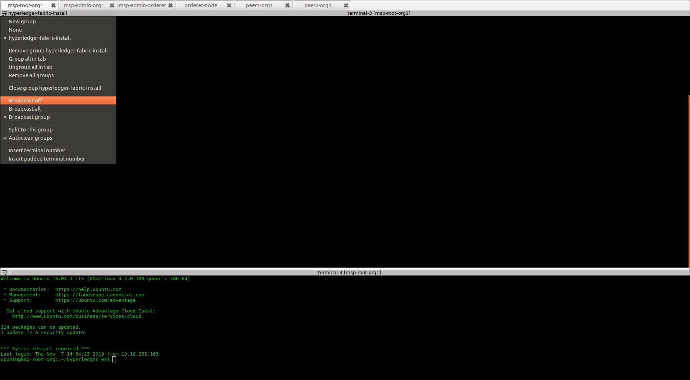

== Configuring Hyperledger Blockchain
:page-navtitle: HLF Multi-node deployment and use
:page-root: ../../../../
:page-category: Blockchain
:toc:
:data-uri: true
:allow-uri-read: true

Before continuing make sure that the terminator broadcast is set to off, as shown below.

From now one, you will run the commands at each individual node.
If some of the concepts mention below are not clear, please refer to the documentation
"Hyperledger Fabric architecture" which describes the elements of Hyperledger Fabric.

include::config_msp.adoc[]
include::config_blockchain.adoc[]
