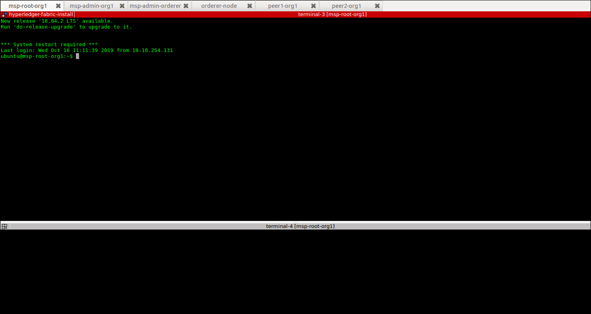

== Installing Hyperledger Fabric software
:page-navtitle: HLF Multi-node deployment and use
:page-root: ../../../../
:page-category: Blockchain
:toc:
:data-uri: true
:allow-uri-read: true

In order to ease the installation process we provide two different terminal
layouts that will be used during the installation and configuration processes.
The first layout configuration file (`terminator_config`) must be used with the
terminal emulator called _terminator_ that must be installed in your local host,
and the second (windows.tmux.hlf) will be used with _byobu_ from a ssh connection
between your local host and one of the virtual machines created by vagrant.
In order to install the Fabric software on the hosts we will use the first
terminal layout based on terminator.

=== Using Terminator layouts

We use the `terminator` to perform some repetitive tasks that are required to
install Hyperledger fabric on all hosts.
The reason is that `terminator` has a very good broadcast feature.
Therefore, to install all the required software at once on hosts we provide
a layout configuration file called `./install/terminator_config` which allows to
run scripts in one terminal screen connected to one machine and broadcast this
commands to the others. Note that, there are other more advanced ways of doing that,
for instance by using https://www.ansible.com[ansible] tool. We have chosen at this
point not to use ansible in order to avoid a stack of configuration tools that would
hide important details of the configuration. We recall that on of our goals is to
make it clear to the reader the configuration and utilization of Hyperledger
Fabric.

First, install `terminator` into your local machine, if you do not have it.
If you already have `terminator` installed please skip this step.
[source, bash]
----
$ sudo apt-get install terminator
----

Then, copy our configuration file to `~/.config/terminator/config` in your home
directory.

[source, bash]
----
$ cp .shared/install/terminator_config  ~/.config/terminator/config
----

Finally invoke the terminator layout to install Hyperledger Fabric as follows:

[source, bash]
----
$ terminator -l simple_hlf
----

As as result terminator  will open a terminal with a specific layout using multiple
tabs.
If everything goes well each tab will be connected through ssh to one of the
Hyperledger hosts deployed by vagrant, as shown below.

NOTE: Please, be sure that any command (e.g., ls) executed in the first tab (msp-root-org1)
is broadcasted to all the other hosts.
If not, check if the option `Broadcast default` is set to `Group` in `terminator`
preferences. If everything goes well with the broadcast, go to the next section.

=== Installing Fabric

In this section we show how to get all the required software installed at all the
hosts at once by using the `terminator` layout shown in the previous section.
Our procedure presents the all the steps required to install Hyperledger Fabric
using our installation scripts.

Go to the first tab (i.e., host msp-root-org1) in your `terminator` environment
and take a look on the installation scripts.

[source, bash]
----
$ cd hyperledger_ws/install
$ ls
    01_install_docker.sh
    02_install_prereqs.sh
    03_install_bootstrap.sh
    04_install_ca_server.sh
    05_setup_go_libs_for_peers_chaincodes.sh
    broadcast_cmd.sh
    check_prereqs.sh
    fabric.env.sh
    setup_byobu.sh
    terminator_config
    windows.tmux.hlf
----

Note that, the scripts are named according to the order of execution (from 01_*.sh
to 05_*.sh) and their function in the installation process (e.g., install_docker, install_ca_sever).

Please, run the scripts one-by-one from the `install` directory at each node as
follows.

[[docker_install]]
==== Install docker

In order to install docker run the script as follows.

[source, bash]
----
$ ./01_install_docker.sh
----

You can also check a full log of docker installation in section
<<appendix:installdocker, Appendix B: Installation logs>>.

When finished, logout from all hosts and reconnect again with the same `terminator`
layout again. Then check the installation as shown below.

[source, bash]
----
$ docker ps
CONTAINER ID    IMAGE   COMMAND    CREATED   STATUS    PORTS   NAMES

$ docker --version
Docker version 19.03.3, build a872fc2

$ docker info
----

==== Install fabric requirements

In order to install Hyperledger Fabric requirements run the script as follows.

[[req_install]]
[source, bash]
----
$ ./02_install_prereqs.sh
----

You can check a full log of fabric requirements installation in section
<<appendix:req_install, Appendix B: Installation logs>>.

When finished, logout from all hosts and reconnect again with the same `terminator`
layout again. Note that, when logging back you will be (from now on) automatically
redirected to `~/hyperledger_ws` directory (i.e., $HYPERLEDGER_HOME).

You can now check if all the fabric basic requirements were install by using the
script below.

[[req_check]]
[source, bash]
----
$~/hyperledger_ws/install$ ./check_prereqs.sh

----

NOTE: Be sure that all requirements are correctly installed on each host.

You can check the output log of the check in section
<<appendix:req_check, Appendix B: Installation logs>>.

==== Install bootstrap binaries and images

In order to install the binaries and required images please run the script as follows.

[[bootstrap_install]]
[source, bash]
----
$ ./03_install_bootstrap.sh
----

You can check the full log of binaries and images installation in section
<<appendix:fabric-bootstrap, Appendix B: Installation logs>>.

==== install Go libraries for peer and chaincode

Run the script as shown below in order to install the GO libraries for peers and
chaincode.

[[go_lib_install]]
[source, bash]
----
$ ./04_setup_go_libs_for_peers_chaincodes.sh
----
Check the full log of Go libraries installation in section
<<appendix:fabric-go-lib, Appendix B: Installation logs>>.

When finished, logout from all hosts.

==== Install CA-Root host

Finally the last step of the installation is to install the certification authority
root server at the host which is in charge of this service.
In our case, the host `msp-root-org1`.
Thus, connect through ssh on this host using the command `vagrant ssh msp-root-org1` from
your local machine and run the following script.
After connected, run the script shown below from the `install` directory.

[[ca_root_install]]
[source, bash]
----
$ ./05_install_ca_server.sh
----

Check the full log of the CA-server installation in section
<<appendix:fabric-ca-root, Appendix B: Installation logs>>.

NOTE: If all the previous steps went well, you are ready to start configuring your
Hyperledger Fabric as we will discuss in the next section.
