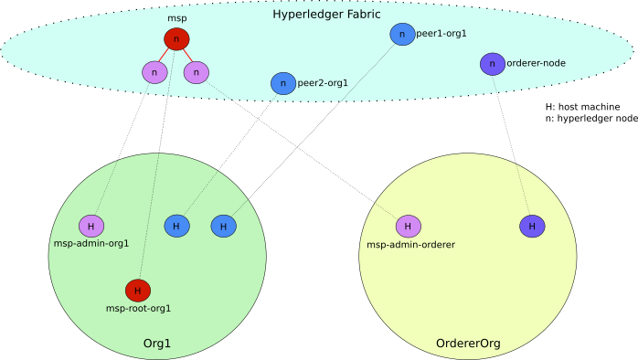

== Introdution

In this document we show how to proceed to deploy a simple Blockchain
infrastructure composed of multiple nodes.
The goal of this study is: _i_) better understand the deployment of Hyperledger
Fabric in realistic environments (i.e., composed of multiple machines).
_ii_) make a step forward from the environment targeted by the official Hyperledger
documentation which is based only on a single node with multiple containers.
We argue that this approch hides many important details of process of deploying
and using the Hyperledger framework.
We propose here a procedure and a series of step-by-step scripts that make it easy
to deploy and use Hyperledger Fabric

=== Target environment

In this document we target a simple environment composed of 2 different
organizations. One organization in charge of orderer nodes and another organization
hosting peers and the MSP root service (e.i., the CA-Root).
The former is composed of 4 (four) hosts (ca-server root, ca-administrator,
peer1 and peer2) and the latter composed of 2 hosts (ca-administrator and orderer node).
The figure below depicts this multi-node environment.
The host msp-root-org1 is the ca-server root. msp-admin-org1 and msp-admin-orderer
are the ca-administrator for each organization, peer1-org1 and peer2-org1 are the
two peers present in the system and the orderer-node is where transactions are
validated. Note that, we use in this example a single node as ordering service in order to
make it easier. In a subsequent document we will improve it with a multi-node
ordering service

:TODO: put a figure here to represent the environment



=== Download scripts

We have created a series of scripts to make the whole process of deploying and using
the Hyperledger Blockchain easier. Our goal is not only facilitate the process of
deploying Hyperledger but also to make it easier to understand every step of the
full process.

To download the scripts follow the *_link_* [[link]].

:TODO: make a link or something to download the scripts.

Download the files within a directory of your choice,
lets call this directory your 'base_local_dir'.
Your 'base_local_dir' will have the following structure.

```
.
├── shared
│   ├── chaincode_examples
│   │   └── example1
│   │       ├── scripts
│   │       └── src
│   ├── config_files
│   ├── install
│   └── setup_scripts
└── src_vagrant
│
└── Vagrantfile
```

The `shared` directory is the directory shared between your local machine and
the hosts (virtual machines) to be used as hyperledger nodes.
We discuss this directory in details later <<shared_vagrant_dir,here>>.
The `src_vagrant` directory has the sources for our vagrant deployment.
Currently, it has two different versions of the `Vagrantfile`, one for Openstack
and another for Virtualbox deployments. We must copy the content of one of this
files into the `Vagrantfile` at the root of you 'base_local_dir', according to the
deployment of your choice. By default we use Openstack deployment.
