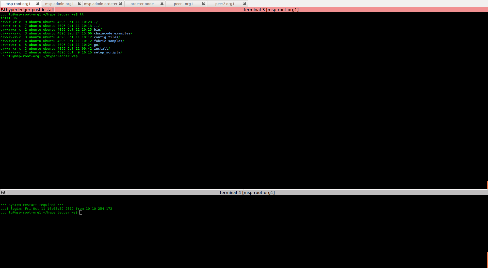

= Deploying Hyperledger Fabric on multiple nodes


== Introdution

In this document we show how to proceed to deploy a simple Blockchain
infrastructure composed of multiple nodes.
The goal of this study is: _i_) better understand the deployment of Hyperledger
Fabric in realistic environments (i.e., composed of multiple machines).
_ii_) make a step forward from the environment targeted by the official Hyperledger
documentation which is based only on a single node with multiple containers.
We argue that this approch hides many important details of process of deploying
and using the Hyperledger framework.
We propose here a procedure and a series of step-by-step scripts that make it easy
to deploy and use Hyperledger Fabric

== Target environment

In this document we target a simple environment composed of 2 different
organizations. One organization in charge of orderer nodes and another organization
hosting peers and the MSP root service (e.i., the CA-Root).
The former is composed of 4 (four) hosts (ca-server, organization's ca-admin,
peer1 and peer2) and the latter composed of 2 hosts (ca-admin and orderer node).
Note that, we use in this example a single node as ordering service in order to
make it easier. In a subsequent document we will improve it with a multi-node
ordering service.

:TODO: put a figure here to represent the environment


== Download scripts

We have created a series of scripts to make the whole process of deploying and using
the Hyperledger Blockchain easier. Our goal is not only facilitate the process of
deploying Hyperledger but also to make it easier to understand every step of the
full process.

To download the scripts follow the *_link_* [[link]].

:TODO: make a link or something to download the scripts.

Download the files within a directory of your choice,
lets call this directory your 'base_local_dir'.
Your 'base_local_dir' will have the following structure.

```
.
├── shared
│   ├── chaincode_examples
│   │   └── example1
│   │       ├── scripts
│   │       └── src
│   ├── config_files
│   ├── install
│   └── setup_scripts
└── src_vagrant
│
└── Vagrantfile
```

The `shared` directory is the directory shared between your local machine and
the hosts (virtual machines) to be used as hyperledger nodes.
We discuss this directory in details later <<shared_vagrant_dir,here>>.
The `src_vagrant` directory has the sources for our vagrant deployment.
Currently, it has two different versions of the `Vagrantfile`, one for Openstack
and another for Virtualbox deployments. We must copy the content of one of this
files into the `Vagrantfile` at the root of you 'base_local_dir', according to the
deployment of your choice. By default we use Openstack deployment.


== How to use the scripts to deploy Hyperledger

If you have successfully downloaded the scripts as described above now you are
able to start using them. Lets start by briefly describing how we use vagrant
to deploy our hosts.

[[conf-overview]]
=== Host configuration

We use https://www.vagrantup.com/[vagrant] to deploy the virtual machines at same
time with a specific configuration. If you do not have vagrant installed in your
local machine yet, please take the time to do that now.
The vagrant file (`Vagrantfile`) is where these configurations are stored.
We use the openstack plugin (https://github.com/ggiamarchi/vagrant-openstack-provider)
to deploy these machines in our Openstack cluster.

In the `Vagrantfile`, each host is defined as an entry in a data structure
called *_cluster_*. Each entry (host) in *_cluster_* has the following structure.

[source, ruby]
----
{
    :name => "msp-root-org1",
    :username => "ubuntu",
    :type => "ca-server",
    :box => "ubuntu1604_img",
    :flavor => "j1.medium",
    :netid => "d085327f-2cea-4e14-8784-764ee72b92f4",
    :netadd => "192.168.1.10",
    :privkeyfile => "~/.ssh/openstack_cloudlab_bcom.key"
}
----
With `name` informing the hostname to be deployed, `username` the default user to
be created in that host, `type` the type of node according to the Hyperledger
architecture (e.g., peer, orderer, msp-admin, msp-root, etc.)
If you want to take a look in the full `Vagrantfile` and the detailed configuration
of all the hosts, check the  <<appendix:vagrantfile, Appendix>>.

=== Deploy all nodes (VMs)

Use the e *vagrant up* command in order to deploy our machines.
Note that, this operation takes few minutes, depending on the number of hosts to
deploy. Thus, execute the command as show below and go for a coffee.

[source, bash]
----
$ vagrant up
----

When the deployment finishes, you can check the status of each deployed virtual machine.

[source, bash]
----
$ vagrant status
Current machine states:
name                      state    provider
--------------------------------------------
msp-root-org1             active (openstack)
msp-admin-org1            active (openstack)
msp-admin-orderer         active (openstack)
orderer-node              active (openstack)
peer1-org1                active (openstack)
peer2-org1                active (openstack)
----

[[shared_vagrant_dir]]
Vagrant creates the hosts defined in the `Vagrantfile` and sets a ssh configuration
`~/.ssh/config` at each node with entries to all the other nodes
as well as `/etc/hosts` and `/etc/resolv.conf` files.
At the end of the process, vagrant will create a directory called `~/hyperledger_ws`
(i.e., hyperledger workspace) at each host which is our HYPERLEDGER_HOME directory.
The directory has the following structure and content.

[source, bash]
----
~/hyperledger_ws$ tree -dL 1
.
├── install
├── setup_scripts
├── config_files
└── chaincode_example
----

- *install*: directory that contains the scripts used to install Hyperledger Fabric
software in the hosts and create the base configuration for each.

- *setup_scripts*: directory that contains the scripts used to set up Hyperledger
environment and its configuration.

- *config_files*: directory that contains template files used to configure Hyperledger
environment.

- *chaincode_examples*: directory that contains the chaincode example used to validate
the installation and configuration.


=== Installing Hyperledger Fabric software

In order to ease the installation process we provide two different terminal
layouts that will be used during the installation and configuration processes.
The first layout configuration file (`terminator_config`) must be used with the
terminal emulator called _terminator_ that must be installed in your local host,
and the second (windows.tmux.hlf) will be used with _byobu_ from a ssh connection
between your local host and one of the virtual machines created by vagrant.
In order to install the Fabric software on the hosts we will use the first
terminal layout based on terminator.

==== Preparing Terminator layout

We use the `terminator` to perform some repetitive  tasks that are required in all
the hosts.
The reason is that `terminator` has a very good broadcast feature.
Therefore, to install some software on at all the hosts we have provided a configuration
file called `./install/terminator_config` which will allow us to run scripts in
one terminal screen connected to one machine and broadcast this commands to the others.

First, install `terminator` into your local machine, if you do not have it.
If you already have `terminator` installed please skip this step.
[source, bash]
----
$ sudo apt-get install terminator
----

Then, copy our configuration file to `~/.config/terminator/config` in your home
directory.

[source, bash]
----
$ cp $HYPERLEDGER_HOME/install/terminator_config  ~/.config/terminator/config
----

Finally invoke the terminator layout to install Hyperledger Fabric as follows:

[source, bash]
----
$ terminator -l simple_hlf
----


As as result terminator  will open a specific layout with multiple tabs.
If everything goes well each tab will be connected through ssh to one of the
Hyperledger hosts deployed by vagrant, as the one shown below.




==== Installing Fabric


=== Setting up Hyperledger configuration


=== Testing the installation


== Using the scripts

=== Putting all the nodes up

The very first action is to put all the nodes up with the base configuration by
running the *vagrant up* command.


=== Setting up nodes configuration

In our environment we want to emulate a realistic scenario. Therefore, different
hosts were created and each host has a distinguish role.

==== Setting Certification authority

The first step is to set up the certification authority infrastructure.

Nodes of type *msp* are the hosts in charge of the cerfification authority (CA).
 Among them, there is a host named *ca-admin* which is the CA administrator.
 The others are named according to the organization they belong to. For instance,
 the host *org1-msp-1* is the host *msp-1* from organization *org1*.

===== CA adminstration host (ca-admin)


.1. log (ssh) into CA administrator host called *ca-admin*


[source, bash]
----
$ vagrant ssh ca-admin

$ cd setup_scripts/
----


.2. Start the CA server.

run *$HYPERLEDGER_HOME/setup_scripts/start_ca_server.sh* to start the CA server.


[source, bash]
----

$ ./start_ca_server.sh

checking /home/ubuntu/hyperledger_ws/ca-server/fabric-ca-server-config.yaml
Server YAML not found in /home/ubuntu/hyperledger_ws/ca-server/
Copying /home/ubuntu/hyperledger_ws/config_files/fabric-ca-server-config.yaml to /home/ubuntu/hyperledger_ws/ca-server
Starting server with: /home/ubuntu/hyperledger_ws/ca-server/fabric-ca-server-config.yaml
./Server Started ... Logs available at /home/ubuntu/hyperledger_ws/ca-server/ca-server.log
---------------------------- /home/ubuntu/hyperledger_ws/ca-server/ca-server.log -----------------------------------
2019/09/02 14:55:22 [INFO] Configuration file location: /home/ubuntu/hyperledger_ws/ca-server/fabric-ca-server-config.yaml
2019/09/02 14:55:22 [INFO] Starting server in home directory: /home/ubuntu/hyperledger_ws/ca-server
2019/09/02 14:55:22 [WARNING] Unknown provider type: ; metrics disabled
2019/09/02 14:55:22 [INFO] Server Version: 1.4.4
2019/09/02 14:55:22 [INFO] Server Levels: &{Identity:2 Affiliation:1 Certificate:1 Credential:1 RAInfo:1 Nonce:1}
2019/09/02 14:55:22 [WARNING] &{69 The specified CA certificate file /home/ubuntu/hyperledger_ws/ca-server/ca-cert.pem does not exist}
2019/09/02 14:55:22 [INFO] generating key: &{A:ecdsa S:256}
2019/09/02 14:55:23 [INFO] encoded CSR
2019/09/02 14:55:23 [INFO] signed certificate with serial number 56730824853204648070401816351616673671938225174
2019/09/02 14:55:23 [INFO] The CA key and certificate were generated for CA acme-ca
2019/09/02 14:55:23 [INFO] The key was stored by BCCSP provider 'SW'
2019/09/02 14:55:23 [INFO] The certificate is at: /home/ubuntu/hyperledger_ws/ca-server/ca-cert.pem
2019/09/02 14:55:24 [INFO] Initialized sqlite3 database at /home/ubuntu/hyperledger_ws/ca-server/fabric-ca-server.db
2019/09/02 14:55:24 [INFO] The issuer key was successfully stored. The public key is at: /home/ubuntu/hyperledger_ws/ca-server/IssuerPublicKey, secret key is at: /home/ubuntu/hyperledger_ws/ca-server/msp/keystore/IssuerSecretKey
2019/09/02 14:55:24 [INFO] Idemix issuer revocation public and secret keys were generated for CA 'acme-ca'
2019/09/02 14:55:24 [INFO] The revocation key was successfully stored. The public key is at: /home/ubuntu/hyperledger_ws/ca-server/IssuerRevocationPublicKey, private key is at: /home/ubuntu/hyperledger_ws/ca-server/msp/keystore/IssuerRevocationPrivateKey
2019/09/02 14:55:24 [INFO] Home directory for default CA: /home/ubuntu/hyperledger_ws/ca-server
2019/09/02 14:55:24 [INFO] Operation Server Listening on [::]:40922
2019/09/02 14:55:24 [INFO] Listening on http://192.168.1.10:7054
----


.3. Enroll the bootstrap identity of our CA server (the admin client)

[source, bash]
----
$ ./enroll_bootstrap_identity.sh

current FABRIC_CA_CLIENT_HOME=/home/ubuntu/hyperledger_ws/ca-client
now FABRIC_CA_CLIENT_HOME=/home/ubuntu/hyperledger_ws/ca-client/caserver/admin
Client YAML not found in /home/ubuntu/hyperledger_ws/ca-client/caserver/admin/
mkdir -p /home/ubuntu/hyperledger_ws/ca-client/caserver/admin
Copying the /home/ubuntu/hyperledger_ws/config_files/fabric-ca-client-config.yaml to /home/ubuntu/hyperledger_ws/ca-client/caserver/admin
Enrolling ca-client with: /home/ubuntu/hyperledger_ws/ca-client/caserver/admin/fabric-ca-client-config.yaml
2019/09/02 14:55:28 [INFO] generating key: &{A:ecdsa S:256}
2019/09/02 14:55:28 [INFO] encoded CSR
2019/09/02 14:55:28 [INFO] Stored client certificate at /home/ubuntu/hyperledger_ws/ca-client/caserver/admin/msp/signcerts/cert.pem
2019/09/02 14:55:28 [INFO] Stored root CA certificate at /home/ubuntu/hyperledger_ws/ca-client/caserver/admin/msp/cacerts/192-168-1-10-7054.pem
2019/09/02 14:55:28 [INFO] Stored Issuer public key at /home/ubuntu/hyperledger_ws/ca-client/caserver/admin/msp/IssuerPublicKey
2019/09/02 14:55:28 [INFO] Stored Issuer revocation public key at /home/ubuntu/hyperledger_ws/ca-client/caserver/admin/msp/IssuerRevocationPublicKey
-------------- showing identities ----------------------
Name: admin, Type: client, Affiliation: , Max Enrollments: -1, Attributes: [{Name:hf.Revoker Value:1 ECert:false} {Name:hf.IntermediateCA Value:1 ECert:false} {Name:hf.GenCRL Value:1 ECert:false} {Name:hf.Registrar.Attributes Value:* ECert:false} {Name:hf.AffiliationMgr Value:1 ECert:false} {Name:hf.Registrar.Roles Value:* ECert:false} {Name:hf.Registrar.DelegateRoles Value:* ECert:false}]
--------------------------------------------------------

----


.4. Register the organization's admin into our CA server

In the following example we are registering 3 admins:  acme, budget and orderer.

[source, bash]
----
$  ./register_admin.sh client acme-admin pw acme acme

current FABRIC_CA_CLIENT_HOME=/home/ubuntu/hyperledger_ws/ca-client
now FABRIC_CA_CLIENT_HOME=/home/ubuntu/hyperledger_ws/ca-client/caserver/admin
total 16
drwxrwxr-x 3 ubuntu ubuntu 4096 Sep  2 14:55 .
drwxrwxr-x 3 ubuntu ubuntu 4096 Sep  2 14:55 ..
-rw-r--r-- 1 ubuntu ubuntu 3281 Sep  2 14:55 fabric-ca-client-config.yaml
drwx------ 6 ubuntu ubuntu 4096 Sep  2 14:55 msp
Registering: acme-admin
2019/09/02 14:55:56 [INFO] Configuration file location: /home/ubuntu/hyperledger_ws/ca-client/caserver/admin/fabric-ca-client-config.yaml
Password: pw
NOTE:  inform the user <acme-admin> and password <pw> to the admin of the organization <acme> (this information is also required to enroll organizations clients)

----

[source, bash]
----
$ ./register_admin.sh client budget-admin pw budget budget

current FABRIC_CA_CLIENT_HOME=/home/ubuntu/hyperledger_ws/ca-client
now FABRIC_CA_CLIENT_HOME=/home/ubuntu/hyperledger_ws/ca-client/caserver/admin
total 16
drwxrwxr-x 3 ubuntu ubuntu 4096 Sep  2 14:55 .
drwxrwxr-x 3 ubuntu ubuntu 4096 Sep  2 14:55 ..
-rw-r--r-- 1 ubuntu ubuntu 3281 Sep  2 14:55 fabric-ca-client-config.yaml
drwx------ 6 ubuntu ubuntu 4096 Sep  2 14:55 msp
Registering: budget-admin
2019/09/02 14:56:05 [INFO] Configuration file location: /home/ubuntu/hyperledger_ws/ca-client/caserver/admin/fabric-ca-client-config.yaml
Password: pw
NOTE:  inform the user <budget-admin> and password <pw> to the admin of the organization <budget> (this information is also required to enroll organizations clients)
----


[source, bash]
----
$ ./register_admin.sh client orderer-admin pw orderer orderer

current FABRIC_CA_CLIENT_HOME=/home/ubuntu/hyperledger_ws/ca-client
now FABRIC_CA_CLIENT_HOME=/home/ubuntu/hyperledger_ws/ca-client/caserver/admin
total 16
drwxrwxr-x 3 ubuntu ubuntu 4096 Sep  2 14:55 .
drwxrwxr-x 3 ubuntu ubuntu 4096 Sep  2 14:55 ..
-rw-r--r-- 1 ubuntu ubuntu 3281 Sep  2 14:55 fabric-ca-client-config.yaml
drwx------ 6 ubuntu ubuntu 4096 Sep  2 14:55 msp
registering an orderer , setting attributes
Registering: orderer-admin
2019/09/02 14:56:11 [INFO] Configuration file location: /home/ubuntu/hyperledger_ws/ca-client/caserver/admin/fabric-ca-client-config.yaml
Password: pw
NOTE:  inform the user <orderer-admin> and password <pw> to the admin of the organization <orderer> (this information is also required to enroll organizations clients)
----


===== Organizations CA admin hosts (ca-admin)

Each organization has its own ca-adminstrator, which will enroll the client
registered by the CA-admin in the previous step.
We have deployed one node for each (org1-msp-1 , org1-msp-2, ordering-0)


.1. Enroll and setup the client for each admin organization (ca-client) into the
ca-server.

.1.1) Log into the org1-msp-1 node and run the following.

[source, bash]
----
$ vagrant ssh org1-msp-1

$ cd setup_scripts

$ ./enroll_admin_and_setup_msp.sh acme ca-admin 192.168.1.10

current FABRIC_CA_CLIENT_HOME=/home/ubuntu/hyperledger_ws/ca-client
now FABRIC_CA_CLIENT_HOME=/home/ubuntu/hyperledger_ws/ca-client/acme/admin

/home/ubuntu/hyperledger_ws/ca-client/acme/admin/fabric-ca-client-config.yaml not found in /home/ubuntu/hyperledger_ws/ca-client/acme/admin/
creating : mkdir -p /home/ubuntu/hyperledger_ws/ca-client/acme/admin

Copy the Client Yaml from /home/ubuntu/hyperledger_ws/config_files/fabric-ca-client-config-acme.yaml
cp /home/ubuntu/hyperledger_ws/config_files/fabric-ca-client-config-acme.yaml /home/ubuntu/hyperledger_ws/ca-client/acme/admin/fabric-ca-client-config.yaml
checking with: ls /home/ubuntu/hyperledger_ws/ca-client/acme/admin/fabric-ca-client-config.yaml
/home/ubuntu/hyperledger_ws/ca-client/acme/admin/fabric-ca-client-config.yaml

Enrolling: acme-admin:
fabric-ca-client enroll -u http://acme-admin:pw@192.168.1.10:7054
2019/09/02 14:56:46 [INFO] generating key: &{A:ecdsa S:256}
2019/09/02 14:56:46 [INFO] encoded CSR
2019/09/02 14:56:46 [INFO] Stored client certificate at /home/ubuntu/hyperledger_ws/ca-client/acme/admin/msp/signcerts/cert.pem
2019/09/02 14:56:46 [INFO] Stored root CA certificate at /home/ubuntu/hyperledger_ws/ca-client/acme/admin/msp/cacerts/192-168-1-10-7054.pem
2019/09/02 14:56:46 [INFO] Stored Issuer public key at /home/ubuntu/hyperledger_ws/ca-client/acme/admin/msp/IssuerPublicKey
2019/09/02 14:56:46 [INFO] Stored Issuer revocation public key at /home/ubuntu/hyperledger_ws/ca-client/acme/admin/msp/IssuerRevocationPublicKey

Creating /home/ubuntu/hyperledger_ws/ca-client/acme/admin/msp/admincerts
====> /home/ubuntu/hyperledger_ws/ca-client/acme/admin/msp/admincerts

copying /home/ubuntu/hyperledger_ws/ca-client/caserver/admin/msp/signcerts/*  to /home/ubuntu/hyperledger_ws/ca-client/acme/admin/msp/admincerts
directory /home/ubuntu/hyperledger_ws/ca-client/caserver/admin/msp/signcerts does not exist locally
getting admin certs using scp
scp ca-admin:/home/ubuntu/hyperledger_ws/ca-client/caserver/admin/msp/signcerts/* /home/ubuntu/hyperledger_ws/ca-client/acme/admin/msp/admincerts
cert.pem                                                                             100%  851     0.8KB/s   00:00
checking with: ls /home/ubuntu/hyperledger_ws/ca-client/acme/admin/msp/admincerts/
cert.pem
create /home/ubuntu/hyperledger_ws/ca-client/acme/admin/../msp subfolders
scp ca-admin:/home/ubuntu/hyperledger_ws/ca-server/ca-cert.pem /home/ubuntu/hyperledger_ws/ca-client/acme/admin/../msp/cacerts
ca-cert.pem                                                                          100%  761     0.7KB/s   00:00

cp /home/ubuntu/hyperledger_ws/ca-client/acme/admin/msp/signcerts/* /home/ubuntu/hyperledger_ws/ca-client/acme/admin/../msp/admincerts

--------------------------------------------------------
Created MSP for org: acme at: /home/ubuntu/hyperledger_ws/ca-client/acme/admin/..
-------------- Listing Identities ----------------------
Name: acme-admin, Type: client, Affiliation: acme, Max Enrollments: 2, Attributes: [{Name:hf.Registrar.Roles Value:peer,user,client ECert:false} {Name:hf.AffiliationMgr Value:true ECert:false} {Name:hf.Revoker Value:true ECert:false} {Name:hf.EnrollmentID Value:acme-admin ECert:true} {Name:hf.Type Value:client ECert:true} {Name:hf.Affiliation Value:acme ECert:true}]
--------------------------------------------------------
----


.1.2)  Log into the org2-msp-2 node and run the following.

[source, bash]
----
$ vagrant ssh org2-msp-2

$ cd setup_scripts

$ ./enroll_admin.sh budget

./enroll_admin.sh budget
my FABRIC_CA_CLIENT_HOME=/home/ubuntu/hyperledger_ws/ca-client/budget/admin
/home/ubuntu/hyperledger_ws/ca-client/budget/admin/fabric-ca-client-config.yaml not found in /home/ubuntu/hyperledger_ws/ca-client/budget/admin/
Copy the Client Yaml from /home/ubuntu/hyperledger_ws/config_files/fabric-ca-client-config-budget.yaml
/home/ubuntu/hyperledger_ws/ca-client/budget/admin/fabric-ca-client-config.yaml
Enrolling: budget-admin
fabric-ca-client enroll -u http://budget-admin:pw@192.168.1.10:7054
2019/08/28 09:31:19 [INFO] generating key: &{A:ecdsa S:256}
2019/08/28 09:31:19 [INFO] encoded CSR
2019/08/28 09:31:19 [INFO] Stored client certificate at /home/ubuntu/hyperledger_ws/ca-client/budget/admin/msp/signcerts/cert.pem
2019/08/28 09:31:19 [INFO] Stored root CA certificate at /home/ubuntu/hyperledger_ws/ca-client/budget/admin/msp/cacerts/192-168-1-10-7054.pem
2019/08/28 09:31:19 [INFO] Stored Issuer public key at /home/ubuntu/hyperledger_ws/ca-client/budget/admin/msp/IssuerPublicKey
2019/08/28 09:31:19 [INFO] Stored Issuer revocation public key at /home/ubuntu/hyperledger_ws/ca-client/budget/admin/msp/IssuerRevocationPublicKey
----

.1.3) Log into the ordering-0 node and run the following.

[source, bash]
----
$ vagrant ssh ordering-0

$ cd setup_scripts

$ ./enroll_admin_and_setup_msp.sh orderer ca-admin 192.168.1.10

current FABRIC_CA_CLIENT_HOME=/home/ubuntu/hyperledger_ws/ca-client
now FABRIC_CA_CLIENT_HOME=/home/ubuntu/hyperledger_ws/ca-client/orderer/admin
/home/ubuntu/hyperledger_ws/ca-client/orderer/admin/fabric-ca-client-config.yaml not found in /home/ubuntu/hyperledger_ws/ca-client/orderer/admin/
creating : mkdir -p /home/ubuntu/hyperledger_ws/ca-client/orderer/admin
Copy the Client Yaml from /home/ubuntu/hyperledger_ws/config_files/fabric-ca-client-config-orderer.yaml
cp /home/ubuntu/hyperledger_ws/config_files/fabric-ca-client-config-orderer.yaml /home/ubuntu/hyperledger_ws/ca-client/orderer/admin/fabric-ca-client-config.yaml
checking with: ls /home/ubuntu/hyperledger_ws/ca-client/orderer/admin/fabric-ca-client-config.yaml
/home/ubuntu/hyperledger_ws/ca-client/orderer/admin/fabric-ca-client-config.yaml
Enrolling: orderer-admin:
fabric-ca-client enroll -u http://orderer-admin:pw@192.168.1.10:7054
2019/09/02 14:57:50 [INFO] generating key: &{A:ecdsa S:256}
2019/09/02 14:57:50 [INFO] encoded CSR
2019/09/02 14:57:51 [INFO] Stored client certificate at /home/ubuntu/hyperledger_ws/ca-client/orderer/admin/msp/signcerts/cert.pem
2019/09/02 14:57:51 [INFO] Stored root CA certificate at /home/ubuntu/hyperledger_ws/ca-client/orderer/admin/msp/cacerts/192-168-1-10-7054.pem
2019/09/02 14:57:51 [INFO] Stored Issuer public key at /home/ubuntu/hyperledger_ws/ca-client/orderer/admin/msp/IssuerPublicKey
2019/09/02 14:57:51 [INFO] Stored Issuer revocation public key at /home/ubuntu/hyperledger_ws/ca-client/orderer/admin/msp/IssuerRevocationPublicKey
Creating /home/ubuntu/hyperledger_ws/ca-client/orderer/admin/msp/admincerts
====> /home/ubuntu/hyperledger_ws/ca-client/orderer/admin/msp/admincerts
copying /home/ubuntu/hyperledger_ws/ca-client/caserver/admin/msp/signcerts/*  to /home/ubuntu/hyperledger_ws/ca-client/orderer/admin/msp/admincerts
directory /home/ubuntu/hyperledger_ws/ca-client/caserver/admin/msp/signcerts does not exist locally
getting admin certs using scp
scp ca-admin:/home/ubuntu/hyperledger_ws/ca-client/caserver/admin/msp/signcerts/* /home/ubuntu/hyperledger_ws/ca-client/orderer/admin/msp/admincerts
The authenticity of host '192.168.1.10 (192.168.1.10)' cant be established.
ECDSA key fingerprint is SHA256:h4NspijfcEHWNxCvWz7QjORMn+1/KO6PCSJz41vE1ws.
Are you sure you want to continue connecting (yes/no)? yes
Warning: Permanently added '192.168.1.10' (ECDSA) to the list of known hosts.
cert.pem                                                                             100%  851     0.8KB/s   00:00
checking with: ls /home/ubuntu/hyperledger_ws/ca-client/orderer/admin/msp/admincerts/
cert.pem
create /home/ubuntu/hyperledger_ws/ca-client/orderer/admin/../msp subfolders
scp ca-admin:/home/ubuntu/hyperledger_ws/ca-server/ca-cert.pem /home/ubuntu/hyperledger_ws/ca-client/orderer/admin/../msp/cacerts
ca-cert.pem                                                                          100%  761     0.7KB/s   00:00
cp /home/ubuntu/hyperledger_ws/ca-client/orderer/admin/msp/signcerts/* /home/ubuntu/hyperledger_ws/ca-client/orderer/admin/../msp/admincerts
--------------------------------------------------------
Created MSP for org: orderer at: /home/ubuntu/hyperledger_ws/ca-client/orderer/admin/..
----


.2. Check the CA-server identity list

Go back to the ca-admin host and run the following command.

[source, bash]
----
./list_ca-server_identity-list.sh

------------Fabric ENV -----------------
FABRIC_ORDERER_HOME=/home/ubuntu/hyperledger_ws/orderer
FABRIC_CA_CLIENT_CONFIG=fabric-ca-client-config.yaml
FABRIC_VERSION=1.4.0
FABRIC_CONFIG_FILES=/home/ubuntu/hyperledger_ws/config_files
FABRIC_LOGGING_SPEC=INFO
FABRIC_USER=ubuntu
FABRIC_CA_SERVER_HOME=/home/ubuntu/hyperledger_ws/ca-server
FABRIC_CA_SERVER_CONFIG=fabric-ca-server-config.yaml
FABRIC_CFG_PATH=/home/ubuntu/hyperledger_ws/orderer
FABRIC_CA_SERVER_LOG=/home/ubuntu/hyperledger_ws/ca-server/ca-server.log
FABRIC_CA_CLIENT_HOME=/home/ubuntu/hyperledger_ws/ca-client

------------Setting HOME ---------------
current FABRIC_CA_CLIENT_HOME=/home/ubuntu/hyperledger_ws/ca-client
now FABRIC_CA_CLIENT_HOME=/home/ubuntu/hyperledger_ws/ca-client/caserver/admin

------------Listing Identities----------
Name: admin, Type: client, Affiliation: , Max Enrollments: -1, Attributes: [{Name:hf.Revoker Value:1 ECert:false} {Name:hf.IntermediateCA Value:1 ECert:false} {Name:hf.GenCRL Value:1 ECert:false} {Name:hf.Registrar.Attributes Value:* ECert:false} {Name:hf.AffiliationMgr Value:1 ECert:false} {Name:hf.Registrar.Roles Value:* ECert:false} {Name:hf.Registrar.DelegateRoles Value:* ECert:false}]

Name: acme-admin, Type: client, Affiliation: acme, Max Enrollments: 2, Attributes: [{Name:hf.Registrar.Roles Value:peer,user,client ECert:false} {Name:hf.AffiliationMgr Value:true ECert:false} {Name:hf.Revoker Value:true ECert:false} {Name:hf.EnrollmentID Value:acme-admin ECert:true} {Name:hf.Type Value:client ECert:true} {Name:hf.Affiliation Value:acme ECert:true}]

Name: budget-admin, Type: client, Affiliation: budget, Max Enrollments: 2, Attributes: [{Name:hf.Registrar.Roles Value:peer,user,client ECert:false} {Name:hf.AffiliationMgr Value:true ECert:false} {Name:hf.Revoker Value:true ECert:false} {Name:hf.EnrollmentID Value:budget-admin ECert:true} {Name:hf.Type Value:client ECert:true} {Name:hf.Affiliation Value:budget ECert:true}]

Name: orderer-admin, Type: client, Affiliation: orderer, Max Enrollments: 2, Attributes: [{Name:hf.Registrar.Roles Value:orderer ECert:false} {Name:hf.EnrollmentID Value:orderer-admin ECert:true} {Name:hf.Type Value:client ECert:true} {Name:hf.Affiliation Value:orderer ECert:true}]
----------------------------------------
----


== Summary

.Files and directories created by each scripts

[width="100%",cols="25,25,25,25",options="header"]
|=========================================================
|script/host-path  | ca-admin/ca-server | ca-admin/ca-client | org-msp/ca-client

| start-ca-server.sh | /home/ubuntu/hyperledger_ws/ca-server/fabric-ca-server-config.yaml   | |
| | ca-server/ca-cert.pem (*CA certificate*)| |
| | ca-server/IssuerPublicKey (*Issuer pub key*)| |
| | ca-server/msp/keystore/IssuerSecretKey (*Issuer priv key*)| |
| | ca-server/IssuerRevocationPublicKey  | |
| | ca-server/msp/keystore/IssuerRevocationPrivateKey | |

| enroll_bootstrap_identity.sh |  |  |
| | | ca-client/caserver/admin/msp/signcerts/cert.pem
(*client certificate*)  |
| | | ca-client/caserver/admin/msp/cacerts/192-168-1-10-7054.pem (*ca-root certificate*)   |
| | | ca-client/caserver/admin/msp/IssuerPublicKey (*Issuer public key*) |
| | | ca-client/caserver/admin/msp/IssuerRevocationPublicKey (*Issuer revocation public key*) |

| register_admin.sh | n/a | n/a | n/a

| enroll_admin.sh 'acme' | | | /home/ubuntu/hyperledger_ws/ca-client/acme/admin/msp/signcerts/cert.pem (*client certificate*)
| | | |  /home/ubuntu/hyperledger_ws/ca-client/acme/admin/msp/cacerts/192-168-1-10-7054.pem (*root CA certificate*)
| | | | /home/ubuntu/hyperledger_ws/ca-client/acme/admin/msp/IssuerPublicKey (*Issuer public key*)
| | | | /home/ubuntu/hyperledger_ws/ca-client/acme/admin/msp/IssuerRevocationPublicKey  (*Issuer revocation public key*)

| ./setup_admin_certs.sh acme ca-admin | | | creates /home/ubuntu/hyperledger_ws/ca-client/acme/admin/msp/admincerts
| | | |  scp ca-admin:/home/ubuntu/hyperledger_ws/ca-client/caserver/admin/msp/signcerts/* /home/ubuntu/hyperledger_ws/ca-client/acme/admin/msp/admincerts
| | | | scp ca-admin:/home/ubuntu/hyperledger_ws/ca-server/ca-cert.pem /home/ubuntu/hyperledger_ws/ca-client/acme/admin/../msp/cacerts

|=========================================================


=== Other Notes

==== variables

- pwd = HLF2/ca/multi-org-ca

- DEFAULT_SERVER_CONFIG_YAML="HLF2/setup/config/multi-org-ca/yaml.0/fabric-ca-server-config.yaml"
- DEFAULT_CLIENT_CONFIG_YAML="HLF2/setup/config/multi-org-ca/yaml.0/fabric-ca-client-config.yaml"
- export FABRIC_CA_SERVER_HOME=HLF2/ca/multi-org-ca/server


==== start_server.sh

. cp $DEFAULT_SERVER_CONFIG_YAML  ./server
. fabric-ca-server start 2> $FABRIC_CA_SERVER_HOME/server.log

==== Enroll the bootstrap admin identity  (enroll_bootstrap.sh)

. FABRIC_CA_CLIENT_HOME=HLF2/ca/multi-org-ca/client/caserver/admin
. mkdir -p $FABRIC_CA_CLIENT_HOME
. cp $DEFAULT_CLIENT_CONFIG_YAML  "$FABRIC_CA_CLIENT_HOME/"


==== Register admins

. source setclient.sh   caserver   admin
. # acme-admin:

 fabric-ca-client register --id.type client --id.name acme-admin --id.secret pw --id.affiliation acme --id.attrs $ATTRIBUTES

. # budget-admin:

 fabric-ca-client register --id.type client --id.name budget-admin --id.secret pw --id.affiliation budget --id.attrs $ATTRIBUTES

. # orderer-admin:

 fabric-ca-client register --id.type client --id.name orderer-admin --id.secret pw --id.affiliation orderer --id.attrs $ATTRIBUTES

==== Enroll admins

===== acme-admin:

. ORG_NAME="acme"
. source setclient.sh   $ORG_NAME   admin
.. FABRIC_CA_CLIENT_HOME=HLF2/ca/multi-org-ca/client/acme/admin
. copy-yaml:
.. SETUP_CONFIG_CLIENT_YAML="HLF2/setup/config/multi-org-ca/yaml.0"
.. mkdir -p $FABRIC_CA_CLIENT_HOME
.. cp "HLF2/setup/config/multi-org-ca/yaml.0/acme/fabric-ca-client-config.yaml" "HLF2/ca/multi-org-ca/client/acme/admin/fabric-ca-client-config.yaml"
. fabric-ca-client enroll -u http://acme-admin:pw@localhost:7054
. setup:
.. ORG_NAME=acme
.. source setclient.sh $ORG_NAME  admin
... FABRIC_CA_CLIENT_HOME=HLF2/ca/multi-org-ca/client/acme
.. ROOT_CA_CERTIFICATE=./server/ca-cert.pem
.. DESTINATION_CLIENT_HOME="HLF2/ca/multi-org-ca/client/acme"
.. mkdir -p $HLF2/ca/multi-org-ca/client/acme/msp/admincerts
.. mkdir -p $HLF2/ca/multi-org-ca/client/acme/msp/cacerts
.. mkdir -p $HLF2/ca/multi-org-ca/client/acme/msp/keystore

.. *# Copy the Root CA Cert*
... cp ./server/ca-cert.pem $HLF2/ca/multi-org-ca/client/acme/msp/cacerts
.. *# Copy the admin certs - ORG admin is the admin for the specified Org*
... cp HLF2/ca/multi-org-ca/client/acme/msp/signcerts/* HLF2/ca/multi-org-ca/client/acme/msp/admincerts

==== Register Enroll orderer:

- pwd=HLF2/orderer/multi-org-ca/

. IDENTITY="admin"
. CA_CLIENT_FOLDER="../../ca/multi-org-ca/client/orderer"
. FABRIC_CA_CLIENT_HOME="HLF2/ca/multi-org-ca/client/orderer/admin"
. SETUP_CONFIG_CLIENT_YAML="HLF2/setup/config/multi-org-ca/yaml.0/identities/orderer/fabric-ca-client-config.yaml"
. mkdir -p HLF2/ca/multi-org-ca/client/orderer/admin
. cp  "HLF2/setup/config/multi-org-ca/yaml.0/identities/orderer/fabric-ca-client-config.yaml" "HLF2/ca/multi-org-ca/client/orderer/admin/fabric-ca-client-config.yaml"
. fabric-ca-client enroll -u http://orderer:pw@localhost:7054
. mkdir -p $FABRIC_CA_CLIENT_HOME/msp/admincerts
. cp $ADMIN_CLIENT_HOME/msp/signcerts/*    $FABRIC_CA_CLIENT_HOME/msp/admincerts


== Appendix A - Configuration files

[[appendix:vagrantfile]]
=== Vagrantfile

[source, ruby]
----
# -*- mode: ruby -*-
# vi: set ft=ruby :

require 'vagrant-openstack-provider'

cluster = [
    {
        :name => "msp-root-org1",
        :type => "caserver",
        :username => "ubuntu",
        :box => "hbr_ubuntu1604_img",
        :flavor => "j1.small",
        :netid => "d085327f-2cea-4e14-8784-764ee72b92f4",
        :netadd => "192.168.1.10",
        :privkeyfile => "~/.ssh/openstack_cloudlab_bcom.key"
    },
    {
        :name => "msp-admin-org1",
        :type => "msp-admin",
        :username => "ubuntu",
        :box => "hbr_ubuntu1604_img",
        :flavor => "j1.small",
        :netid =>  "d085327f-2cea-4e14-8784-764ee72b92f4",
        :netadd => "192.168.1.11",
        :privkeyfile => "~/.ssh/openstack_cloudlab_bcom.key"
    },
    {
        :name => "msp-admin-org2",
        :type => "msp-admin",
        :username => "ubuntu",
        :box => "hbr_ubuntu1604_img",
        :flavor => "j1.small",
        :netid =>  "d085327f-2cea-4e14-8784-764ee72b92f4",
        :netadd => "192.168.1.12",
        :privkeyfile => "~/.ssh/openstack_cloudlab_bcom.key"
    },
    {
        :name => "msp-admin-orderer",
        :type => "msp-admin",
        :username => "ubuntu",
        :box => "hbr_ubuntu1604_img",
        :flavor => "j1.small",
        :netid =>  "d085327f-2cea-4e14-8784-764ee72b92f4",
        :netadd => "192.168.1.13",
        :privkeyfile => "~/.ssh/openstack_cloudlab_bcom.key"
    },
    {
        :name => "orderer-node",
        :type => "orderer",
        :username => "ubuntu",
        :box => "hbr_ubuntu1604_img",
        :flavor => "j1.small",
        :netid =>  "d085327f-2cea-4e14-8784-764ee72b92f4",
        :netadd => "192.168.1.14",
        :privkeyfile => "~/.ssh/openstack_cloudlab_bcom.key"
    },
    {
        :name => "peer1-org1",
        :type => "peer",
        :username => "ubuntu",
        :box => "hbr_ubuntu1604_img",
        :flavor => "j1.small",
        :netid =>  "d085327f-2cea-4e14-8784-764ee72b92f4",
        :netadd => "192.168.1.15",
        :privkeyfile => "~/.ssh/openstack_cloudlab_bcom.key"
    },
    {
        :name => "peer1-org2",
        :type => "peer",
        :username => "ubuntu",
        :box => "hbr_ubuntu1604_img",
        :flavor => "j1.small",
        :netid =>  "d085327f-2cea-4e14-8784-764ee72b92f4",
        :netadd => "192.168.1.16",
        :privkeyfile => "~/.ssh/openstack_cloudlab_bcom.key"
    },
    {
        :name => "peer2-org1",
        :type => "peer",
        :username => "ubuntu",
        :box => "hbr_ubuntu1604_img",
        :flavor => "j1.small",
        :netid =>  "d085327f-2cea-4e14-8784-764ee72b92f4",
        :netadd => "192.168.1.17",
        :privkeyfile => "~/.ssh/openstack_cloudlab_bcom.key"
    },
    {
        :name => "peer2-org2",
        :type => "peer",
        :username => "ubuntu",
        :box => "hbr_ubuntu1604_img",
        :flavor => "j1.small",
        :netid =>  "d085327f-2cea-4e14-8784-764ee72b92f4",
        :netadd => "192.168.1.18",
        :privkeyfile => "~/.ssh/openstack_cloudlab_bcom.key"
    }

]

# data structs for creating the config file in ~/.ssh
ssh_config = []
ssh_entry = { :hostname => "", :username => "" , :ipadd => "", :keyfile => "" }

# data structs for updating the resolv.conf file
dns_config = []
dns_entry = { :hostname => "", :ipadd => "" }

# initialization scripts

$setSSHDNSconfig = <<-SCRIPT
    echo "-------------------------------------------"
    echo "allNodes script started"
    # setup ~/.ssh/config file at all the nodes to allow connection among them.
    # (after deployment only the floating IP of the first vm is required to connect)
    echo "Setting ~/.ssh/config"
    mv /home/ubuntu/hyperledger_ws/config_files/ssh_config_template /home/ubuntu/.ssh/config
    mv /home/ubuntu/hyperledger_ws/install/openstack_cloudlab_bcom.key /home/ubuntu/.ssh/openstack_cloudlab_bcom.key
    chown ubuntu:ubuntu /home/ubuntu/.ssh/config /home/ubuntu/.ssh/openstack_cloudlab_bcom.key
    echo "-------------------------------------------"
    echo "Setting /etc/hosts"
    if [ -f /etc/hosts ]; then
        echo " " | tee -a /etc/hosts
        cat /home/ubuntu/hyperledger_ws/config_files/dns_config_template | tee -a /etc/hosts
    else
        echo "Warning: /etc/hosts does not exist"
    fi
    echo "-------------------------------------------"
    mkdir -p /home/ubuntu/hyperledger_ws/install/logs
    chown -R ubuntu:ubuntu /home/ubuntu/hyperledger_ws/install/logs
    echo "-------------------------------------------"
SCRIPT


#vagrant config
Vagrant.configure("2") do |config|

    config.ssh.username = "ubuntu"
    config.ssh.private_key_path = '/home/rheverson/.ssh/openstack_cloudlab_bcom.key'

    config.vm.provider :openstack do |os|
        os.openstack_auth_url = 'http://10.50.0.103:5000/v2.0'
        os.username = '<user_name>'
        os.password = '****'
        os.tenant_name = '<project-name>'
        os.security_groups = ['default']
        os.availability_zone = 'nova'
        os.region = 'regionOne'
        os.keypair_name = 'openstack_cloudlab_bcom'

    end

    cluster.each do |opts|
        config.vm.define opts[:name] do |node|
            node.vm.provider :openstack do |os, override|
                os.server_name = opts[:name]
                os.image = opts[:box]
                os.flavor = opts[:flavor]
                os.networks = [{ id: opts[:netid], address: opts[:netadd] }]
                os.floating_ip_pool = 'ext_net'
                override.vm.synced_folder '.', '/vagrant', disabled: true  # this
                override.vm.synced_folder './shared', '/home/ubuntu/hyperledger_ws/', type: 'rsync'  #   rsync and none as types present some bugs
            end
            ## for all:
            node.vm.provision "shell", inline: $setSSHDNSconfig
        end

        new_ssh_entry = Hash.new()
        new_ssh_entry[:hostname] = opts[:name]
        new_ssh_entry[:username] = opts[:username]
        new_ssh_entry[:ipadd] = opts[:netadd]
        new_ssh_entry[:keyfile] = opts[:privkeyfile]
        ssh_config.push << new_ssh_entry

        new_dns_entry = Hash.new()
        new_dns_entry[:hostname] = opts[:name]
        new_dns_entry[:ipadd] = opts[:netadd]
        dns_config.push << new_dns_entry
    end

    # Create a ssh config
    File.open("./shared/config_files/ssh_config_template", "w+") do |f|
        ssh_config.each { |element| f.puts("Host " + element[:hostname].to_s, "     User " + element[:username].to_s, "     Hostname " + element[:ipadd].to_s, "     IdentityFile " + element[:keyfile].to_s) }
    end

    # Create the dns config
    File.open("./shared/config_files/dns_config_template", "w+") do |f|
        dns_config.each { |element| f.puts(element[:ipadd].to_s + "   " + element[:hostname].to_s) }
    end
end
----

<<conf-overview, [back]>>
